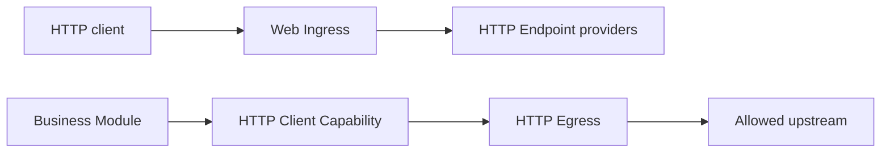

Backend HTTP uses two independent Capability pairs. Inbound traffic binds Web
Ingress to one or more `lenso.http.endpoint@1` providers. Outbound traffic
binds a consumer to the policy-bounded HTTP Egress provider of
`lenso.http.client@1`.



These backend contracts are separate from target-owned browser UI. Web Shell,
Browser Adapter, and UI Contribution Modules compose pages and generated
browser clients; they do not own backend HTTP routing.

## Publish an inbound endpoint

Use the endpoint macro so `describe` and `handle` share one compile-time checked
route table:

```rust title="src/http.rs"
use lenso_capability_http_endpoint::{
    endpoint, HandleRequest, HandleResponse, HandleResponseHeadersItem,
    EndpointHandleInvocationError,
};
use lenso_kernel::InvocationContext;

#[derive(Clone, Debug, Default)]
struct OrdersHttp;

#[endpoint]
impl OrdersHttp {
    #[post("orders.create", "/orders")]
    async fn create(
        &self,
        _context: InvocationContext,
        _request: HandleRequest,
    ) -> Result<HandleResponse, EndpointHandleInvocationError> {
        Ok(HandleResponse {
            status: 201,
            headers: vec![HandleResponseHeadersItem {
                name: "content-type".into(),
                value: "application/json".into(),
            }],
            body: br#"{"id":"order-42"}"#.as_slice().into(),
        })
    }
}
```

`#[endpoint]` collects the handlers in one `impl`. Use `#[get]`, `#[post]`,
`#[put]`, `#[patch]`, `#[delete]`, `#[head]`, or `#[options]`; each attribute
declares a stable route ID followed by its path. The `http_endpoint!` static
table remains available for generated code and existing Modules.

The endpoint owns HTTP-shaped business behavior. Web Ingress owns listener and
protocol mechanics, route matching, path parameters, size and concurrency
limits, deadlines, disconnect cancellation, request IDs, and stable HTTP error
mapping. Route collisions fail activation.

Configure one immutable Ingress Instance in the Plan:

```json
{
  "bind_address": "0.0.0.0:8080",
  "max_request_body_bytes": 1048576,
  "max_request_head_bytes": 16384,
  "max_concurrent_requests": 128,
  "request_timeout_millis": 30000
}
```

The default is an ephemeral loopback listener. Web Ingress accepts a single
`Authorization` credential as evidence, strips credential and hop-by-hop
headers before invocation, and replaces untrusted external request IDs. The
target Auth and business Modules still own authentication and authorization.

## Call an upstream service

HTTP Egress requires at least one exact `http` or `https` origin. Paths,
credentials, queries, and fragments are invalid in `allowed_origins`.

```rust
use lenso_http_egress::HttpEgressConfig;
use std::time::Duration;

let config = HttpEgressConfig::new(["https://api.example.test"])?
    .with_transfer_limits(1024 * 1024, 16 * 1024, 4 * 1024 * 1024, 32 * 1024)?
    .with_max_concurrent_requests(64)?
    .with_timeouts(Duration::from_secs(5), Duration::from_secs(30))?;
```

Resolve the generated client from the consumer's declared dependencies:

```rust
use lenso_capability_http_client::{
    ClientClient, ClientInvocationError, SendRequest, SendRequestHeadersItem,
};
use lenso_kernel::{ModuleDependencies, RuntimeFailure};

fn client(dependencies: &ModuleDependencies) -> Result<ClientClient, RuntimeFailure> {
    ClientClient::from_dependencies(dependencies)
}

async fn send(client: &ClientClient) -> Result<i64, ClientInvocationError> {
    let response = client.send(SendRequest {
        method: "POST".into(),
        url: "https://api.example.test/orders".into(),
        headers: vec![SendRequestHeadersItem {
            name: "content-type".into(),
            value: "application/json".into(),
        }],
        body: br#"{"total_cents":4200}"#.as_slice().into(),
    }).await?;
    Ok(response.status)
}
```

The generated Domain Errors are `destination_not_allowed`, `invalid_request`,
`request_too_large`, `response_too_large`, `timeout`, and
`transport_failure`. The current provider does not follow redirects, use
system proxies, manage cookies, or retry requests implicitly.

Both HTTP contracts are portable and have generated TypeScript bindings.
However, the maintained Ingress and Egress providers are linked Rust Modules;
a Bun Module must still receive the Capability through an execution path and
binding supported by its host. Contract portability is not automatic provider
installation.
