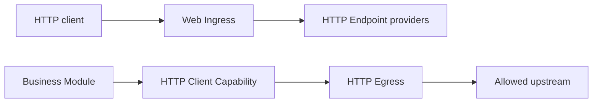

Backend HTTP uses two independent Capability pairs. Inbound traffic binds Web
Ingress to one or more `lenso.http.endpoint@1` providers. Outbound traffic
binds a consumer to the policy-bounded HTTP Egress provider of
`lenso.http.client@1`.



These backend contracts are separate from target-owned browser UI. Web Shell,
Browser Adapter, and UI Contribution Modules compose pages and generated
browser clients; they do not own backend HTTP routing.

## Publish an inbound endpoint

Use the endpoint macro so `describe` and `handle` share one compile-time checked
route table:

```rust title="src/http.rs"
use lenso_capability_http_endpoint::{
    endpoint, HandleResponse, EndpointHandleInvocationError, Json,
    response::{self, HeaderValue, StatusCode, header},
};
use lenso_kernel::InvocationContext;
use serde::{Deserialize, Serialize};

#[derive(Deserialize)]
struct CreateOrder {
    total_cents: u64,
}

#[derive(Serialize)]
struct CreatedOrder<'a> {
    id: &'a str,
}

#[derive(Clone, Debug, Default)]
struct OrdersHttp;

#[endpoint]
impl OrdersHttp {
    #[post("orders.create", "/orders")]
    async fn create(
        &self,
        _context: InvocationContext,
        Json(_order): Json<CreateOrder>,
    ) -> Result<HandleResponse, EndpointHandleInvocationError> {
        Ok(response::json(
            StatusCode::CREATED,
            &CreatedOrder { id: "order-42" },
        )?.with_header(
            &header::LOCATION,
            &HeaderValue::from_static("/orders/order-42"),
        )?)
    }
}
```

`#[endpoint]` collects the handlers in one `impl`. Use `#[get]`, `#[post]`,
`#[put]`, `#[patch]`, `#[delete]`, `#[head]`, or `#[options]`; each attribute
declares a stable route ID followed by its path. The `http_endpoint!` static
table remains available for generated code and existing Modules.

The endpoint owns HTTP-shaped business behavior. Web Ingress owns listener and
protocol mechanics, route matching, path parameters, size and concurrency
limits, deadlines, disconnect cancellation, request IDs, and stable HTTP error
mapping. Route collisions fail activation.

Use `response::json`, `response::problem`, `response::text`, and
`response::empty` for common responses. They accept typed status codes, set the
appropriate content type, and keep serialization failures on the Endpoint
error path. `HandleResponse::with_header` accepts validated `http` header names
and values when a response needs `Location`, `WWW-Authenticate`, or another
explicit header. Construct the generated wire DTO directly only for unusual
binary response bodies.

## Authenticate an inbound request

Web Ingress selects one `Authorization` credential and places its scheme and
value in `HandleRequest::credential`. It does not authenticate the caller. The
Endpoint resolves the explicitly bound `AuthClient` during activation, submits
the protocol-neutral evidence, and attaches the returned `ActorAssertion` to
the invocation context before calling the business Capability:

```rust title="src/http.rs"
use std::rc::Rc;

use lenso_auth_sdk::ActorAssertion;
use lenso_capability_auth::AuthClient;
use lenso_capability_http_endpoint::{
    EndpointHandleInvocationError, ExtractorFuture, FromRequest,
    HandleRequest, HandleResponse, Path, endpoint,
};
use lenso_http_auth::{
    AuthClientSource, AuthenticatedHttpActor, extract_authenticated_actor,
};
use lenso_kernel::InvocationContext;
use serde::Deserialize;

#[derive(Deserialize)]
struct OrderPath {
    order_id: String,
}

struct UserActor {
    subject: String,
}

impl AuthenticatedHttpActor for UserActor {
    const KIND: &'static str = "user";

    fn from_assertion(assertion: &ActorAssertion) -> Self {
        Self { subject: assertion.subject().to_owned() }
    }
}

impl AuthClientSource for OrdersHttp {
    fn auth_client(&self) -> Result<Rc<AuthClient>, EndpointHandleInvocationError> {
        Ok(self.auth.clone())
    }
}

impl FromRequest<OrdersHttp> for UserActor {
    fn from_request<'a>(
        provider: &'a OrdersHttp,
        context: &'a mut InvocationContext,
        request: &'a HandleRequest,
    ) -> ExtractorFuture<'a, Self> {
        extract_authenticated_actor(provider, context, request)
    }
}

#[endpoint]
impl OrdersHttp {
    #[get("orders.read", "/orders/{order_id}")]
    async fn read(
        &self,
        actor: UserActor,
        context: InvocationContext,
        Path(path): Path<OrderPath>,
    ) -> Result<HandleResponse, EndpointHandleInvocationError> {
        self.handle_authenticated(context, actor.subject, path.order_id).await
    }
}
```

`extract_authenticated_actor` owns evidence conversion, Auth invocation, stable `401`/`403`
responses, and assertion attachment. `OrdersHttp::auth` and its Orders client are created once from
`ActivateContext::dependencies()` and released during deactivation; do not
resolve bindings for every request. The target Orders Module must still verify
the assertion proof, issuer, validity, and operation audience before projecting
it into its own typed actor. See [Auth Module](/docs/auth-module/) for the
provider and target-side code.

Extractors run in handler-argument order. They may await clients stored on the
provider, enrich the context for later extractors and the handler, return an
intentional response, or preserve an Endpoint failure. `Path<T>`, `Query<T>`,
`Json<T>`, and `RequestId` are built in. Invalid path, query, or JSON input is
rejected before the handler runs.

Use middleware for behavior that naturally wraps many handler arguments, such
as tracing or a shared response policy. Authentication is usually clearer as a
`UserActor` or `AdminActor` extractor because the expected identity kind is
visible in the handler signature. These are application-owned HTTP-edge identity
types implementing `AuthenticatedHttpActor`; Lenso does not impose one universal
user model. This trait is deliberately different from target-side `TypedActor`.
`AdminActor` should
only mean a distinct authenticated actor kind. Do not use the extractor to grant
roles, tenant access, or resource ownership—the target Module still owns those
decisions.

`handle_authenticated` is Endpoint-owned application code: it calls
`self.orders` with the assertion-bearing context, serializes the success value
with `response::json`, and maps the target's authorization rejection to an
explicit `403` Problem Details response.

Keep these mappings intentional:

| Outcome | Endpoint response |
| --- | --- |
| Missing, invalid, expired, or revoked credential | `401` Problem Details and `WWW-Authenticate` |
| Valid actor without permission for the target operation | Endpoint maps the target Module's authorization rejection to `403` |
| Malformed path, query, or body | `400` |
| JSON extractor with a missing or unsupported content type | `415` |
| Auth or business Capability unavailable | `503` |
| Response serialization or header construction fails | internal Endpoint failure, mapped to `503` |

Ingress owns transport errors; Auth owns evidence authentication; the target
business Module owns the final authorization decision. A successful Auth call
must not be treated as blanket permission.

Configure one immutable Ingress Instance in the Plan:

```json
{
  "bind_address": "0.0.0.0:8080",
  "max_request_body_bytes": 1048576,
  "max_request_head_bytes": 16384,
  "max_concurrent_requests": 128,
  "request_timeout_millis": 30000
}
```

The default is an ephemeral loopback listener. Web Ingress strips credential
and hop-by-hop headers before invocation and replaces untrusted external
request IDs.

## Call an upstream service

HTTP Egress requires at least one exact `http` or `https` origin. Paths,
credentials, queries, and fragments are invalid in `allowed_origins`.

```rust
use lenso_http_egress::HttpEgressConfig;
use std::time::Duration;

let config = HttpEgressConfig::new(["https://api.example.test"])?
    .with_transfer_limits(1024 * 1024, 16 * 1024, 4 * 1024 * 1024, 32 * 1024)?
    .with_max_concurrent_requests(64)?
    .with_timeouts(Duration::from_secs(5), Duration::from_secs(30))?;
```

Resolve the generated client from the consumer's declared dependencies:

```rust
use lenso_capability_http_client::{
    ClientClient, ClientInvocationError, SendRequest, SendRequestHeadersItem,
};
use lenso_kernel::{ModuleDependencies, RuntimeFailure};

fn client(dependencies: &ModuleDependencies) -> Result<ClientClient, RuntimeFailure> {
    ClientClient::from_dependencies(dependencies)
}

async fn send(client: &ClientClient) -> Result<i64, ClientInvocationError> {
    let response = client.send(SendRequest {
        method: "POST".into(),
        url: "https://api.example.test/orders".into(),
        headers: vec![SendRequestHeadersItem {
            name: "content-type".into(),
            value: "application/json".into(),
        }],
        body: br#"{"total_cents":4200}"#.as_slice().into(),
    }).await?;
    Ok(response.status)
}
```

The generated Domain Errors are `destination_not_allowed`, `invalid_request`,
`request_too_large`, `response_too_large`, `timeout`, and
`transport_failure`. The current provider does not follow redirects, use
system proxies, manage cookies, or retry requests implicitly.

Both HTTP contracts are portable and have generated TypeScript bindings.
However, the maintained Ingress and Egress providers are linked Rust Modules;
a Bun Module must still receive the Capability through an execution path and
binding supported by its host. Contract portability is not automatic provider
installation.
