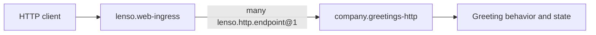

This guide builds a small JSON backend with two routes:

```text
POST /greetings
GET  /greetings/{greeting_id}
```

The work crosses two Plugin boundaries. The Endpoint Plugin owns the API and
business-facing HTTP mapping. `lenso.web-ingress` owns the listener and inbound
transport.



## Current authoring boundary

The public CLI does not currently provide a generic
`lenso plugin new --web` command. Work inside a Host workspace that already
links the native Lenso runtime and can publish a Host Catalog.

The current authoring surface is:

- `lenso-capability-http-endpoint` for typed routes and extractors;
- `lenso-web-ingress` for inbound HTTP transport; and
- the Host's linked native factory, registry, and Catalog path.

App configuration cannot make an implementation appear in a Host build. The
Endpoint Plugin and Ingress must first be available in the Host Catalog.

## Follow the implementation path

| Step | Document | Observable result |
| --- | --- | --- |
| 1 | [Write the Endpoint Plugin](/docs/web-endpoint-plugin) | Two stable route descriptions and direct handler tests pass. |
| 2 | [Connect the Host and Ingress](/docs/web-host-integration) | The resolved App shows the Endpoint Instance bound to Ingress. |
| 3 | [Prove the HTTP backend](/docs/web-testing) | Success, failure, collision, and removal paths pass through a real socket. |

Read [Web Capabilities](/docs/web-capabilities) when changing middleware,
limits, cancellation, or outbound HTTP. Read [Auth Plugin](/docs/auth-plugin)
when a route must authenticate evidence and propagate assertions.

## Check the Host before starting

Confirm these conditions in the target repository:

1. The repository selects Rust 1.94 or newer.
2. Its lock contains `lenso-capability-http-endpoint` and
   `lenso-web-ingress`, or the Host owner approved adding them.
3. The Host registry can link another native factory.
4. The Host Catalog can expose `company.greetings-http` and bind it to the
   Ingress `many lenso.http.endpoint@1` requirement.
5. A real Host or integration test can expose the listener address.

Stop at the first missing prerequisite and resolve it with the Host owner. The
current `lenso-web` owner repository uses `lenso-capability-http-endpoint`
0.2.3 and `lenso-web-ingress` 0.3.3. Another Host should use the exact versions
selected by its own lock.

## Definition of done

The backend is complete when both routes run through the real Ingress, success
and failure responses remain distinguishable, duplicate routes block readiness,
the resolved App shows the exact binding, and removing the Endpoint Instance
removes both routes from the next Generation.

Start with [Write the Endpoint Plugin](/docs/web-endpoint-plugin).
