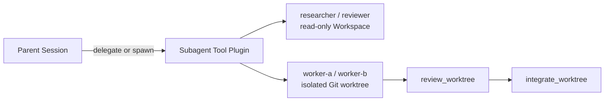

The official `code` and `code-sandbox` Profiles include bounded child Agents.
The parent stays in control: a child is selected as a Tool target, receives a
fresh durable Session, and returns a bounded result. This is not a handoff or a
shared group chat.

## Choose the smallest delegation mode

| Need | Tool | Lifecycle |
| --- | --- | --- |
| One bounded answer before continuing | `delegate` | Waits and returns the result in one call |
| Work that may continue while the parent does something else | `spawn_subagent` | Returns a task ID |
| Observe without consuming a result | `list_subagents` | Stable, non-blocking snapshot |
| Collect a terminal result and release its slot | `wait_subagent` | Consumes the result |
| Add direction at the next model boundary | `send_subagent` | Durably records accepted input |
| Stop detached work | `cancel_subagent` | Requests cancellation |

The available child name is selected from the immutable Plan. Official coding
Profiles currently expose read-only `researcher` and `reviewer` Agents plus
mutation-capable `worker-a` and `worker-b` lanes.

## Understand the authority boundary

Read-only children use a restricted Tool set. Root write and process authority
does not automatically flow into them. Every child gets a fresh Session rather
than inheriting the parent's whole transcript.

Mutation-capable workers first receive a dedicated Git worktree below the Agent
Home runtime directory. Workspace read, edit, process, and Git providers all
observe that same scoped path; the parent Workspace remains unchanged.

## Review mutation before integration

Child completion does not merge its work. The parent follows a separate,
reviewed sequence:

1. `list_worktrees` finds retained allocations.
2. `review_worktree` requires a clean child checkout and locks its exact HEAD
   and diff digest.
3. `integrate_worktree` verifies the retained review again, requires a clean
   parent Workspace, and performs a non-fast-forward merge.

Dirty, changed-after-review, conflicting, and over-capacity states fail closed.
No force cleanup or automatic conflict resolution is implied.

## Know what is durable

The child Session is the durable execution record. Task handles and allocation
registries belong to the active Generation: they do not promise recovery after
Host suspension or a Generation switch. `list_subagents` does not consume a
terminal result; only `wait_subagent` releases that task slot.

If you only need read-only planning, use the `plan` Profile instead of creating
a child task. See [Profiles and Tools](/docs/agent/profiles-and-tools).
