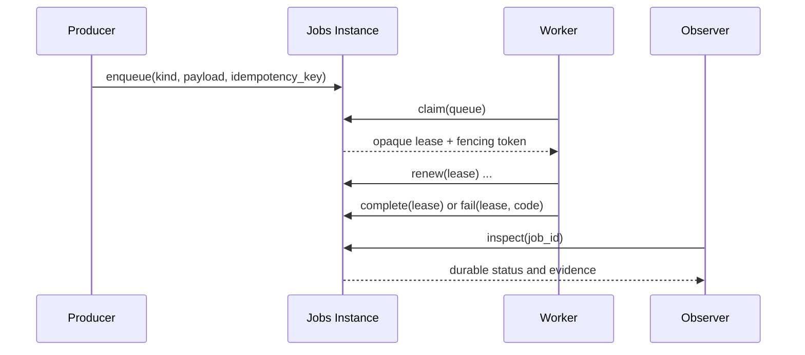

This guide covers the first-party durable Jobs Plugin in
[`LioRael/lenso-jobs-plugin`](https://github.com/LioRael/lenso-jobs-plugin). It
teaches one bounded path: an authorized producer enqueues a typed Job, an
authorized worker claims it under a lease, and an observer inspects the durable
result. The Jobs Module owns queue and lease state; a consuming business Module
owns payload meaning and every external effect.

## Task map

| Outcome | Prerequisites | Owner and current availability | Observable success | Expected failure | Next page |
| --- | --- | --- | --- | --- | --- |
| Enqueue one typed Job | A Host-selected Jobs Instance with a prepared private PostgreSQL schema, an allowed producer Instance, and a caller-scoped idempotency key | Jobs owns queue placement and availability time; the business Module owns payload schema and meaning; exact availability depends on Host composition | `enqueue` accepts the Job and an observer can later inspect its durable identity | Unauthorized caller, duplicate intent with a conflicting key, or schema readiness failure | [Supported workflows](/docs/core/supported-workflows) |
| Claim, renew, complete, fail, and recover one Job | An allowed worker Instance and an opaque lease returned by `claim` | Jobs owns attempt count, lease generation, expiry, retry schedule, and terminal status; workers must make external effects idempotent | `complete` records success, or `fail` records retryable/non-retryable evidence; an expired lease is reclaimed with a new fencing token | Expired or fenced lease cannot complete, worker loss causes reclaim, or bounded retries reach terminal failure | [Inspect one Job](/docs/core/jobs) |
| Inspect the durable evidence | An allowed observer Instance and the Jobs capability binding | Jobs owns stable status and last failure code; PostgreSQL is a private persistence Adapter | `inspect` shows identity, queue, attempt, lease/retry state, and terminal evidence without changing the Job | Missing observer authorization or schema unavailable during preparation | [Repository map](/docs/core/repository-map) |

The source repository is the evidence for this Capability contract. This page
does not promise a new public package, shared database, or hosted queue. A Host
must choose and prepare a Jobs Instance before a producer or worker can use it.

## 1. Define one Jobs Instance

Each keyed Jobs Instance declares its allowed queues and caller Instances. Use
separate Instances when queues cross trust or operational boundaries. The owner
README's representative configuration is:

```json
{
  "schema": "jobs_email",
  "database_url_secret": "jobs/database-url",
  "lease_seconds": 30,
  "retry_base_seconds": 5,
  "retry_max_seconds": 300,
  "queues": ["email"],
  "producer_instances": ["accounts", "organization"],
  "worker_instances": ["email-worker"],
  "observer_instances": ["operations"]
}
```

The Database URL is behind the explicitly bound Secrets Capability. PostgreSQL
is a private persistence Adapter; setup and upgrades are explicit operator
workflows. The Module verifies its schema during `prepare` and keeps its
configuration immutable after the factory validates it.

## 2. Produce one typed Job

The portable `lenso.jobs@1` Capability provides `enqueue`, `claim`, `renew`,
`complete`, `fail`, and `inspect`. A consuming business Module selects the Job
kind and owns the payload schema. The Jobs Module owns only the durable control
fields:

- Job identity, queue placement, and availability time;
- attempt count, lease generation, and lease expiry;
- retry schedule and terminal status; and
- the last stable failure code.

Enqueue with a caller-scoped idempotency key. If a producer retries after an
ambiguous transport result, it can repeat the same intent without creating an
unbounded duplicate. Idempotency at enqueue does not make an email, payment, or
other external effect safe; the worker's business code must make each effect
idempotent too.

## 3. Claim and fence one worker attempt

The worker calls `claim` for an allowed queue and receives an opaque lease. The
lease carries no business authority that a browser or caller can invent. The
worker may `renew` it while processing, then either `complete` or `fail` it.



An expired lease can never complete a Job. A later worker may reclaim it with a
new fencing token. This prevents a delayed first worker from publishing a stale
success after the Job has been reassigned. Treat processing as at-least-once:
the business Module must guard external effects with its own idempotency key or
deduplication boundary.

## 4. Recover failures and retries

`fail` records whether the error is retryable or terminal. Retryable failure
uses the bounded `retry_base_seconds` and `retry_max_seconds` policy. When the
attempt budget is exhausted, the Job becomes terminal and retains the last
stable failure code for inspection. A worker crash or lease expiry follows the
same reclaim path; it is not a successful completion.

| Evidence | Owner response |
| --- | --- |
| Lease expired or fencing token is stale | Reject completion; reclaim with a new lease and fencing token |
| Transient business failure | Record retryable `fail`; wait for the bounded retry schedule |
| Permanent business failure | Record non-retryable `fail`; retain terminal evidence |
| External effect may have happened before a crash | Reconcile through the business Module's idempotency or deduplication boundary before retrying |

## 5. Inspect one Job

An allowed observer calls `inspect` to read durable evidence without changing
the Job. At minimum, the evidence should let operations identify the Job and
queue, see the attempt and lease/retry state, and read terminal status or the
last stable failure code. The observer does not become a worker and cannot
complete another Instance's lease.

Use [Inspect and troubleshoot an App](/docs/core/inspect-an-app) when the Host
cannot resolve the Jobs Instance or its Secrets/Database binding. Use the
[repository map](/docs/core/repository-map) when a proposed change crosses from
queue mechanics into business payload or external-effect ownership.

## Deferred by this contract

The first Jobs slice is deliberately single-step. It does not include recurring
schedules, priorities, cancellation, progress streams, workflow graphs,
business handler implementation, external-effect idempotency, Kernel
scheduling, or a Web/Console surface. Add one of those only when a real
consumer has an owner contract and evidence for it; do not infer it from the
existence of `enqueue` and `claim`.
