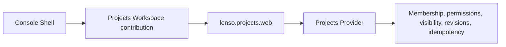

This path describes the Projects integration owned by
[`LioRael/lenso-projects-web-plugin`](https://github.com/LioRael/lenso-projects-web-plugin).
It covers a Console Workspace contribution and its authenticated Web contract.
The Web Plugin is a linked native Plugin, not a portable Bundle or a standalone
HTTP server. A Host must compose it explicitly.

## Task map

| Outcome | Prerequisites | Owner and current availability | Observable success | Expected failure | Next page |
| --- | --- | --- | --- | --- | --- |
| Open an authorized workspace | A Host that links the Web and Workspace Plugins, a bound Projects Provider and Organization Directory, a signed-in user, and an active membership | Console owns Shell placement and selected-workspace context; the Projects Provider owns membership and visibility; this integration is Git-distributed/source-first | `/api/projects/workspaces` returns the authenticated memberships, one workspace opens automatically, and **Switch workspace** returns to the selector | Missing directory binding, expired login, `401`, `403`, or visibility-safe `404` | [Inspect an App](/docs/core/inspect-an-app) |
| Read or create a project or issue | An authorized selected organization, the corresponding Projects capability binding, and a session cookie or supported credential | The Web Plugin maps HTTP to Projects capabilities; the Provider owns facts, permissions, revisions, and idempotency | The roadmap/project detail or issue queue loads; an authorized create or update returns its record and can be read again | Wrong actor kind `403`, hidden resource `404`, revision/idempotency conflict `409`, or invalid request `400` | [Jobs: producer and worker boundary](/docs/core/jobs) |

The source repositories are the evidence for this path. The Workspace package
is Git-distributed and the UI contracts are unpublished; the business Web crate
has its own release boundary. Do not turn a source checkout into a public npm,
crates.io, or hosted-Service availability claim.

## 1. Select a workspace

The Console entry lists the authenticated user's active memberships through
`/api/projects/workspaces`. One workspace opens automatically when exactly one
is available; **Switch workspace** returns to the selector when the user has
more than one. Organization IDs come from the authenticated membership list;
they are not free-form user input.

The consuming App must bind the Organization Directory Port and allow its
Projects Web Instance as a directory caller. The current source integration
requires Organization Directory descriptor 1.1.0 and its matching PostgreSQL
Provider. Until that dependency is published, the owner README describes a
source checkout with a repository-relative Cargo patch for validation.

The selector proves membership discovery, not record access. A workspace still
needs the selected organization's authorized team and project capabilities.

## 2. Understand the composition boundary

The Projects Web Plugin exposes `lenso.http.endpoint@1` and delegates project,
issue, comment, update, and catalog facts to the bound Projects capabilities. A
Host must:

1. link the native crate and build a registry with linked factories;
2. place `lenso.projects.web` in the resolved App Plan;
3. bind its Auth, Projects, Projects Collaboration, and Projects Admin
   requirements; and
4. bind the Host's Web Ingress `many lenso.http.endpoint@1` requirement.

The Console Host can additionally admit
`lenso.console.workspace.projects`, which owns the `projects` Workspace
contribution and a fixed-operation business adapter. Installing the business
Web crate alone does not add Console navigation.

Console owns the primary rail, context sidebar, theme, footer, and mini Agent.
The Workspace renders only Projects content in that Shell. A same-process
Workspace can use a request-scoped signed assertion; an explicitly external
business App uses a separate, short-lived delegated grant. The separate Agent
business connection is not silently shared with the Workspace.

## 3. Read the Projects surface

The current product surface includes:

- projects: list, create, read, update, and archive;
- issues: list, create, read, update, move, and archive;
- comments: list, add, update, and delete;
- project updates: list and create; and
- read-only catalogs: teams, statuses, workflow states, cycles, milestones,
  and labels.

The browser uses the App's existing HttpOnly `session` cookie, or the Host's
supported credential protocol. The page does not ask JavaScript to store a
bearer token. For session-authenticated mutations, the Host selects `session`
evidence and forwards the exact Origin; missing or mismatched Origin fails
closed.

The Web Plugin does not persist, reconstruct, cache, or independently authorize
these facts. It authenticates ingress evidence through exactly one
`lenso.auth@1`, attaches the resulting `ActorAssertion`, and invokes the target
capability with `_with_context`.

## 4. Create or read one record

Start from the selected organization and use the normal Projects view. A
successful project or issue mutation returns the record that the Provider
accepted; fetch it again from the issue queue or project detail to prove the
write is durable at the owning boundary.

| Response | Meaning | Recovery |
| --- | --- | --- |
| `401` | Missing or invalid credentials | Re-authenticate through the App-owned login route and preserve the validated same-origin return path |
| `403` | The actor kind is not allowed for this operation | Use a supported user/actor identity; do not widen the Web Plugin's authority |
| `404` | The resource is missing or hidden by private-team visibility | Check the selected membership and organization; do not infer whether a private resource exists |
| `409` | Revision or idempotency conflict | Refresh the Provider state, choose an explicit revision, or reuse the same idempotency key for the same intent |
| `400` | Invalid request | Correct the typed request before retrying |

Membership, permission, private-team visibility, revision checks, and
idempotency remain Provider decisions. A browser route or Console Workspace
cannot bypass them by assembling a partial project or team list.

## 5. Know what remains source-only or deferred

The optional `chrome.Sidebar` component supplies plugin-owned navigation inside
the existing context sidebar. Older Hosts use the page-header workspace menu.
Neither path gives the Projects Plugin a second application Shell, an arbitrary
proxy, or a new credential authority.

The current integration does not promise an independent Console product,
shared database, generic managed Service, or public UI package. It also does
not turn source delivery into a new npm or crates.io release. For the durable
single-step background boundary, continue with [Run one durable Job](/docs/core/jobs).
