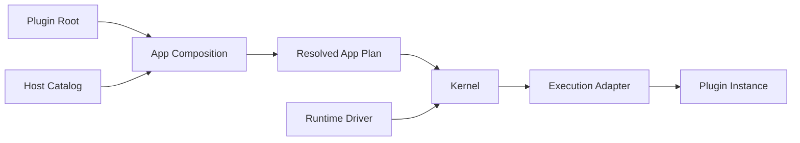

You only need six ideas to make sense of the rest of the framework. Imagine an
App whose Agent can call an `uppercase` Tool.

| Idea | In the example | Responsibility |
| --- | --- | --- |
| **App** | The complete Agent product | The behavior the owner intends to run. |
| **Plugin** | `company.uppercase` | One removable unit of product behavior. |
| **Capability** | `lenso.agent.tool-provider@1` | The typed role through which Plugins collaborate. |
| **Plugin Instance** | `company.uppercase/default` | One configured selection of a Plugin. |
| **Host** | The Agent executable | Supplies the allowed Plugin inventory and host mechanisms. |
| **Resolved App Plan** | The exact accepted graph | Immutable execution input consumed by the Kernel. |

## From an authoring choice to running behavior

The App owner changes visible Plugin selections and configuration. Composition
resolves those choices against the Host Catalog and fails before boot if a
required Capability is missing or ambiguous. The Kernel receives only the
accepted Plan; it does not discover Plugins or repair the graph while running.

## A Capability is a role, not an implementation

The Agent Loop requires a Tool Provider Capability. The `uppercase` Plugin is
one implementation of that role. Another Plugin can provide the same contract,
and App Composition selects the exact binding before startup.

This separation is what makes behavior replaceable: consumers depend on the
Capability, while the App owns the implementation choice.

## What to read next

<CardGroup>
  <Card title="Change your first App" href="/docs/core/first-app-change" description="Take the Plugin Bundle through one real Host and reversible Plugin Root change." />
  <Card title="What is a Plugin?" href="/docs/core/plugins-and-capabilities" description="See the package, implementation, Instance, and connection boundaries in detail." />
  <Card title="Add Plugins to an App" href="/docs/core/plugin-composition" description="Change one visible Plugin Root and inspect the resolved result." />
  <Card title="Core architecture" href="/docs/core/architecture" description="Study the stable ownership seams below the authoring workflow." />
</CardGroup>
