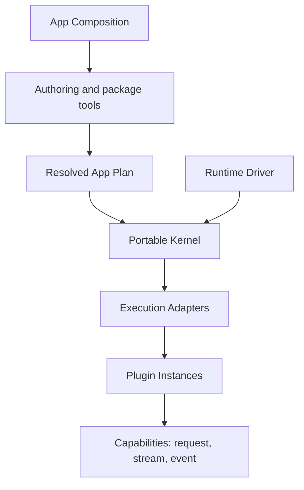

## Build products from replaceable Plugins

Lenso is a local-first, language-independent runtime for products whose
behavior must be added, replaced, and removed without turning composition into
hidden framework magic.

Define product roles as typed Capabilities, implement them as Plugins, and let
each Host resolve one exact application before it boots. Humans and coding
agents work against the same inspectable Plugin Root, while the runtime keeps
lifecycle, failure, and execution choices explicit.

Lenso is designed for long-lived business systems, developer tools,
automation products, and Agent applications. It is not a Web framework or a
distributed control plane.

<CardGroup>
  <Card title="Create your first Plugin" href="/docs/quickstart" description="Install the CLI, run one typed Plugin, and verify its distributable Bundle." />
  <Card title="See what is implemented" href="/docs/status-and-scope" description="Review stable, early-access, and deliberately deferred capabilities." />
</CardGroup>

## Why Lenso exists

In a long-lived product, a feature rarely stays in one file. Its configuration,
state, permissions, background work, and failure policy spread across the
application. Removing or replacing it then becomes risky, and coding agents
have to infer boundaries that the system never recorded.

Lenso makes those product boundaries executable:

- **Plugins own behavior.** Removing a Plugin removes its product complexity.
- **Capabilities define collaboration.** Consumers depend on typed roles, not
  a provider's private code or transport.
- **The Plugin Root shows intent.** An App owner changes visible Plugin
  selections and configuration instead of hand-authoring a runtime graph.
- **Resolution fails before boot.** Incompatible or ambiguous selections do
  not become partially running applications.

Under that product workflow, Lenso separates runtime responsibilities that
often collapse into one layer:

Lenso separates those concerns:

- **Composition** selects Plugins, binds Capabilities, and produces the Plan.
- **The Kernel** validates and executes the Plan with portable lifecycle rules.
- **Runtime Drivers** provide scheduling, clocks, cancellation, and shutdown.
- **Execution Adapters** connect the Kernel to concrete Plugin implementations.
- **Plugins** own product behavior behind typed Capability Interfaces.

This separation makes application structure inspectable before execution and
keeps host-specific mechanisms out of the portable core.

## The runtime model

The Plan is the complete execution input. It records Plugin identities,
Capability bindings, execution classes, connections, policies, and the data
needed to admit the application. Once resolved, the Plan is immutable; the
Kernel does not discover or rewrite the graph while booting.

The Kernel owns graph validation, staged lifecycle, readiness, invocation,
cancellation, supervision, and bounded diagnostics. It does **not** own network,
filesystem, database, process, Auth, telemetry, Console, or business semantics.

## Core concepts

| Concept | Responsibility |
| --- | --- |
| **App Composition** | Declares the application and selects compatible implementations. |
| **Resolved App Plan** | Provides the canonical, immutable input accepted by the runtime. |
| **Capability** | Defines a versioned Interface with request, stream, or event Operations. |
| **Plugin** | Implements product behavior and declares the Capabilities it provides or requires. |
| **Kernel** | Owns portable admission, lifecycle, invocation, cancellation, and diagnostics. |
| **Runtime Driver** | Supplies host scheduling, time, task joining, cancellation, and shutdown. |
| **Execution Adapter** | Runs a Plugin implementation in a concrete environment or transport. |

## Portable does not mean environment-free

The same Kernel semantics can be compiled for native, browser JavaScript, and
WASIp2 host profiles. Each profile still needs a Driver and compatible
Execution Adapters. Portability means the Kernel does not absorb those host
mechanisms; it does not imply that every Plugin runs unchanged in every
environment.

## Current implementation boundary

- `lenso-app-plan` owns the serializable execution input.
- `lenso-kernel` owns portable runtime semantics and deterministic conformance.
- `lenso-runtime-conformance` owns product-neutral runtime proofs.
- Drivers, Execution Adapters, protocols, optional Plugins, authoring, and
  examples live in separate owner repositories.
- Runtime discovery, hot graph mutation, distributed placement, automatic
  replicas, and an independent Console product are not current runtime promises.

See [Status and scope](/docs/status-and-scope) for the precise implemented,
early-access, and deliberately deferred boundaries.

## Where to go next

<CardGroup>
  <Card title="Develop Lenso with an Agent" href="/docs/agent-skills" description="Install the six public workflows, route the task to the right owner, and drive the Agent to inspectable delivery." />
  <Card title="Plugin quickstart" href="/docs/quickstart" description="Create and package one self-contained Rust or Bun Plugin." />
  <Card title="Build a Web backend" href="/docs/web-backend" description="Implement typed JSON routes, bind them through Web Ingress, and exercise the real socket path." />
  <Card title="Build an Agent product" href="/docs/agent-development" description="Run the maintained Host, choose the smallest product extension point, and iterate from one observable behavior." />
  <Card title="Configure an Agent" href="/docs/agent-configuration" description="Start with local Plugin files, then publish reviewed changes through SQLite or a Host-owned remote authority." />
  <Card title="Give the Agent a new Tool" href="/docs/first-app" description="Create an Agent Tool, run it, package it, install it into a real Host, and remove it again." />
  <Card title="Choose a Plugin path" href="/docs/choose-plugin-path" description="Compare portable Rust, linked Rust, and Bun without confusing authoring paths with interaction shapes." />
  <Card title="Core architecture" href="/docs/architecture" description="Study the ownership boundaries between composition, Kernel, Driver, and Adapter." />
  <Card title="Capability authoring" href="/docs/capability-authoring" description="Define Request, Stream, and Event contracts and generate each owned language projection." />
  <Card title="Portable Rust Plugin" href="/docs/plugin-authoring" description="Build one Agent Tool source as Wasm, trusted Process, or both." />
  <Card title="Linked Rust Plugin" href="/docs/linked-rust-plugin" description="Implement deep native behavior with typed configuration, Ports, lifecycle, and generated registration." />
  <Card title="Bun Plugins" href="/docs/bun-plugin-authoring" description="Generate a complete typed project and develop it with fresh Plans and hot reload." />
  <Card title="Plugin configuration" href="/docs/plugin-configuration" description="Use typed Instance TOML, structured resources, external secrets, validation, and publication." />
  <Card title="Web Capabilities" href="/docs/web-capabilities" description="Publish HTTP endpoints and call policy-bounded upstream services." />
  <Card title="Auth Plugin" href="/docs/auth-plugin" description="Authenticate evidence, propagate assertions, and authorize at the target." />
  <Card title="Persistence and secrets" href="/docs/postgres-kit" description="Own a PostgreSQL schema and resolve secret references without leaking them into the Plan." />
</CardGroup>
