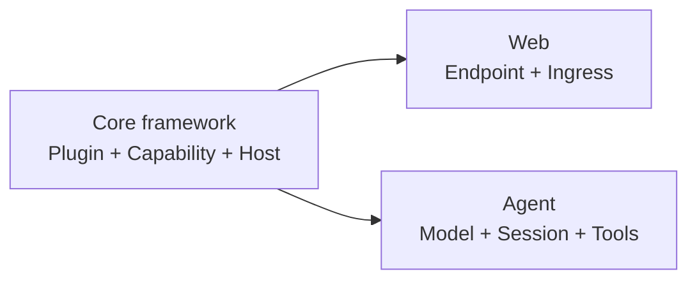

## What do you want to build?

You do not need to learn the entire runtime before starting. Choose the result
you want, complete one guided path, and follow the linked framework concepts
only when they become relevant.

<CardGroup>
  <Card title="Learn the core framework" href="/docs/core" description="Create one removable Plugin, then understand Apps, Capabilities, Hosts, Plans, and runtime lifecycle." />
  <Card title="Build a Web backend" href="/docs/web" description="Write typed HTTP endpoints, bind them through Web Ingress, and prove the result through a real socket." />
  <Card title="Run and extend an Agent" href="/docs/agent" description="Run the maintained Agent, choose a Profile, understand its state, and add one Tool." />
</CardGroup>

## Choose a product task

The framework paths above explain how to build. These task paths explain what
you can operate today and which owner supplies each boundary. Availability is
per Host and repository composition; a source repository alone is not a public
package or hosted-service promise.

| Outcome | Prerequisites | Owner and availability | Observable success | Expected failure | Next page |
| --- | --- | --- | --- | --- | --- |
| Launch Console and identify the App Agent and Console Agent | A local Console checkout, matching Agent binaries, and a configured App | Console owns the Shell, identity catalog, selected-App context, and integration; the maintained local reference Host is the current path | `http://127.0.0.1:3030` opens and the identity selector shows both Agents | Missing or incompatible binaries, an unavailable Host Catalog, or a loopback service that is not ready | [Launch and inspect Console](/docs/core/console) |
| Inspect or configure the selected App through its Plugin Root | A running Console and an App Root that the Host can resolve | The App's Plugin Root and business Plugin own configuration facts and final authorization; Console contributes the management surface | `lenso app check` and `lenso app show` describe the selected App, and an accepted change appears after restart | Root/catalog mismatch, missing Capability, or an authority that the selected Host did not explicitly contribute | [Launch and inspect Console](/docs/core/console) |
| Open an authorized Projects workspace and create or read a project or issue | A Host that links the Projects Web and Workspace Plugins, an authenticated user, and an authorized membership | Projects Provider owns membership, permissions, private visibility, revisions, and idempotency; the integration is Git-distributed/source-first | The workspace selector opens an authorized organization and the roadmap, project, or issue view returns data | `401`, `403`, visibility-safe `404`, or revision/idempotency `409` | [Open Projects](/docs/core/projects) |
| Enqueue, claim, complete, fail, retry, or inspect one durable Job | A Host-selected Jobs Instance, its private PostgreSQL schema, and authorized producer, worker, and observer Instances | Jobs owns queue state, opaque fenced leases, retries, and evidence; the current path is a single-step Plugin contract | A worker completes or reports failure under a lease; an expired lease is safely reclaimed and an observer sees durable state | Invalid caller, lease expiry/fencing conflict, retry exhaustion, or schema readiness failure | [Run one durable Job](/docs/core/jobs) |

Use the linked pages for the full prerequisites, owner boundary, availability
statement, success evidence, and recovery path for each outcome.

## How the three areas connect

Web and Agent are product paths built on the same framework. Their tutorials
teach only the Core concepts needed for the next step and link back to the
canonical explanation instead of duplicating it.

## Looking for an exact answer?

<CardGroup>
  <Card title="Choose a supported workflow" href="/docs/core/supported-workflows" description="Match your product goal and environment to a maintained Lenso path." />
  <Card title="Repository map" href="/docs/core/repository-map" description="Find the repository that owns a contract, runtime mechanism, or product Plugin." />
  <Card title="Develop with a coding agent" href="/docs/core/agent-skills" description="Install Lenso's development skills and route a bounded task to the correct owner." />
</CardGroup>
