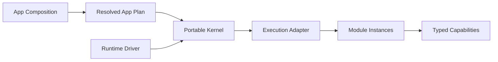

Lenso is a local-first, language-independent runtime for modular applications.
You describe the App before boot—locked packages, keyed Module Instances,
typed Capability bindings, configuration, and execution choices—then run one
immutable **Resolved App Plan** through a portable Kernel.

The practical payoff is control: dependencies are inspectable before startup,
product behavior stays removable, and host mechanics do not leak into the
business model.

## Pick the shortest useful start

<CardGroup>
  <Card title="Run a Module" href="/quickstart" description="Generate a typed Bun Module, start it through the production Adapter, and run the repeatable checks." />
  <Card title="Build a product feature" href="/build-a-feature" description="Follow one vertical slice through ownership, contract, implementation, Composition, behavior, and removal." />
  <Card title="Work with an agent" href="/agent-skills" description="Load the agent-readable docs, install the Lenso skills, and give a coding agent a checkable outcome." />
  <Card title="Choose another path" href="/choose-a-path" description="Route Capability, Rust, Bun, Web, Auth, persistence, runtime, or debugging work without reading everything first." />
</CardGroup>

## The model in 60 seconds

| Part | Owns |
| --- | --- |
| **App Composition** | Package, Instance, configuration, binding, execution, and placement choices |
| **Resolved App Plan** | Canonical immutable bytes accepted at boot |
| **Kernel** | Graph validation, lifecycle, invocation, cancellation, readiness, supervision, diagnostics |
| **Runtime Driver** | Scheduling, monotonic time, task joining, cancellation lanes, host shutdown |
| **Execution Adapter** | Module generation, endpoint, process/wire, isolation, host failure mechanics |
| **Module** | Product facts, policy, state meaning, external resources, and managed work |
| **Capability** | A versioned Request, Stream, or Event role Interface between Modules |

The Kernel does not discover packages, rewrite bindings, install providers, or
mutate the graph while starting. Change the project, resolve a new Plan, review
it, and restart.

## What works today

- The portable Kernel implements Request, Stream, Event, staged lifecycle,
  deadlines, cancellation, diagnostics, and deterministic conformance.
- Native Rust Modules support the complete current interaction surface through
  statically registered factories.
- The public Bun SDK provides a typed Request Provider and a production
  child-process Adapter with a generated development loop.
- Capability tooling generates committed Rust and TypeScript bindings from one
  Descriptor and JSON Schema source.
- Optional repositories provide Web, Auth, secrets, PostgreSQL lifecycle,
  OpenTelemetry, and target-owned Web UI building blocks.

Lenso does not currently promise runtime discovery, hot graph mutation,
distributed placement, automatic replicas, hostile-code isolation, or a
standalone Console product. Read [Implementation status](/status-and-scope)
before planning around a repository name or retained Interface.

## How to read these docs

1. **Start here** pages choose a runnable path and define completion.
2. **Build** pages implement one branch end to end.
3. **Operate** pages verify behavior and classify failures.
4. **Concepts** explain stable mental models only when the task needs them.
5. **Reference** routes ownership, current support, and normative decisions.

For coding agents, every page is available as raw Markdown by appending `.md`.
The site also publishes `https://lenso.dev/llms.txt`,
`https://lenso.dev/llms-full.txt`, and
`https://lenso.dev/agent-readability.json`. These are documentation artifacts,
not Lenso runtime protocols or product capabilities.
