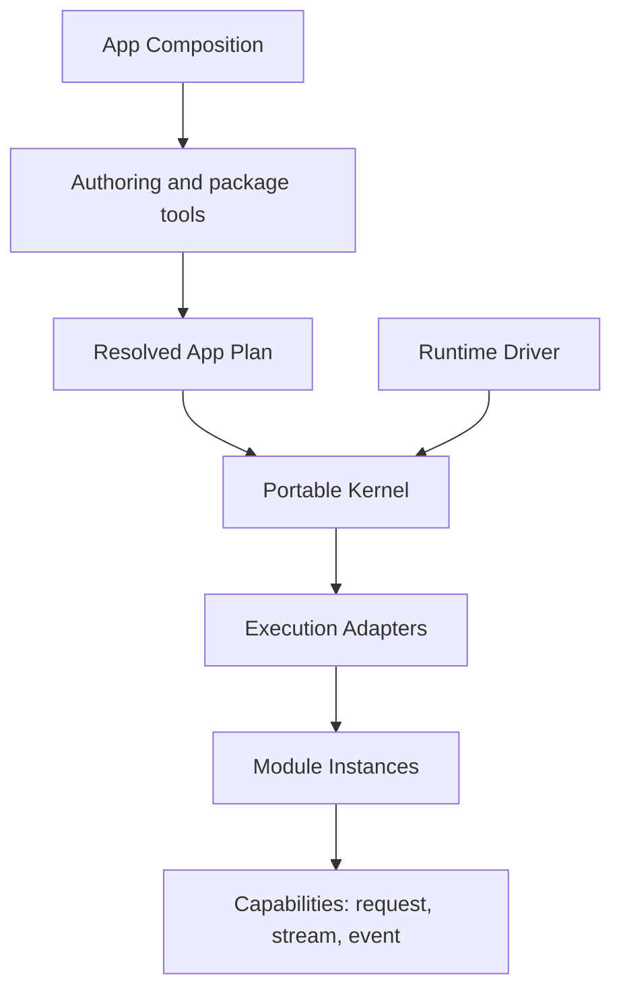

Lenso is a local-first, language-independent runtime for modular applications.
It turns an application's Modules, Capability bindings, execution choices, and
policies into an immutable **Resolved App Plan**, then runs that plan through a
small portable Kernel.

The central idea is simple: decide the application before boot, keep runtime
semantics explicit, and leave environment-specific work at the host boundary.

## Why Lenso exists

Modular systems often become difficult to reason about because composition,
runtime scheduling, transport, infrastructure, and product behavior collapse
into the same layer. The result is usually implicit dependency discovery,
environment-specific lifecycle behavior, and configuration that cannot be
validated until the application is already running.

Lenso separates those concerns:

- **Composition** selects Modules, binds Capabilities, and produces the Plan.
- **The Kernel** validates and executes the Plan with portable lifecycle rules.
- **Runtime Drivers** provide scheduling, clocks, cancellation, and shutdown.
- **Execution Adapters** connect the Kernel to concrete Module implementations.
- **Modules** own product behavior behind typed Capability Interfaces.

This separation makes application structure inspectable before execution and
keeps host-specific mechanisms out of the portable core.

## The runtime model

The Plan is the complete execution input. It records Module identities,
Capability bindings, execution classes, connections, policies, and the data
needed to admit the application. Once resolved, the Plan is immutable; the
Kernel does not discover or rewrite the graph while booting.

The Kernel owns graph validation, staged lifecycle, readiness, invocation,
cancellation, supervision, and bounded diagnostics. It does **not** own network,
filesystem, database, process, Auth, telemetry, Console, or business semantics.

## Core concepts

| Concept | Responsibility |
| --- | --- |
| **App Composition** | Declares the application and selects compatible implementations. |
| **Resolved App Plan** | Provides the canonical, immutable input accepted by the runtime. |
| **Capability** | Defines a versioned Interface with request, stream, or event Operations. |
| **Module** | Implements product behavior and declares the Capabilities it provides or requires. |
| **Kernel** | Owns portable admission, lifecycle, invocation, cancellation, and diagnostics. |
| **Runtime Driver** | Supplies host scheduling, time, task joining, cancellation, and shutdown. |
| **Execution Adapter** | Runs a Module implementation in a concrete environment or transport. |

## Portable does not mean environment-free

The same Kernel semantics can be compiled for native, browser JavaScript, and
WASIp2 host profiles. Each profile still needs a Driver and compatible
Execution Adapters. Portability means the Kernel does not absorb those host
mechanisms; it does not imply that every Module runs unchanged in every
environment.

## Current implementation boundary

- `lenso-app-plan` owns the serializable execution input.
- `lenso-kernel` owns portable runtime semantics and deterministic conformance.
- `lenso-runtime-conformance` owns product-neutral runtime proofs.
- Drivers, Execution Adapters, protocols, optional Modules, authoring, and
  examples live in separate owner repositories.
- Runtime discovery, hot graph mutation, distributed placement, automatic
  replicas, and an independent Console product are not current runtime promises.

See [Status and scope](/docs/status-and-scope) for the precise implemented,
early-access, and deliberately deferred boundaries.

## Where to go next

<CardGroup>
  <Card title="Quickstart" href="/docs/quickstart" description="Build the portable core, inspect the authoring CLI, and follow a Plan from project input to execution." />
  <Card title="Core architecture" href="/docs/architecture" description="Study the ownership boundaries between composition, Kernel, Driver, and Adapter." />
  <Card title="Capability authoring" href="/docs/capability-authoring" description="Define Request, Stream, and Event contracts and generate both language bindings." />
  <Card title="Rust Modules" href="/docs/module-authoring" description="Implement a generated Provider and register its native factory." />
  <Card title="Bun Modules" href="/docs/bun-module-authoring" description="Build and run a TypeScript Provider through the Bun process Adapter." />
  <Card title="Auth Module" href="/docs/auth-module" description="Authenticate evidence, propagate assertions, and authorize at the target." />
</CardGroup>
