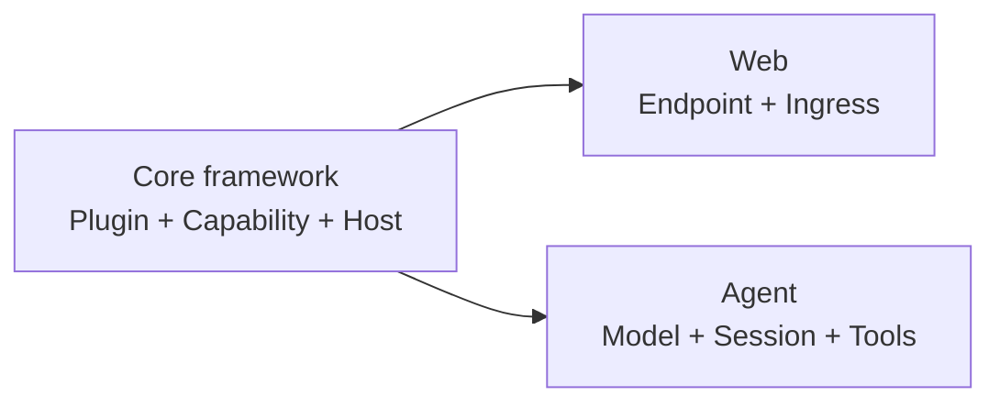

## What do you want to build?

You do not need to learn the entire runtime before starting. Choose the result
you want, complete one guided path, and follow the linked framework concepts
only when they become relevant.

<CardGroup>
  <Card title="Learn the core framework" href="/docs/core" description="Create one removable Plugin, then understand Apps, Capabilities, Hosts, Plans, and runtime lifecycle." />
  <Card title="Build a Web backend" href="/docs/web" description="Write typed HTTP endpoints, bind them through Web Ingress, and prove the result through a real socket." />
  <Card title="Run and extend an Agent" href="/docs/agent" description="Run the maintained Agent, choose a Profile, understand its state, and add one Tool." />
</CardGroup>

## How the three areas connect

Web and Agent are product paths built on the same framework. Their tutorials
teach only the Core concepts needed for the next step and link back to the
canonical explanation instead of duplicating it.

## Looking for an exact answer?

<CardGroup>
  <Card title="Implementation status" href="/docs/core/status-and-scope" description="Separate what runs today from early-access and deliberately deferred behavior." />
  <Card title="Repository map" href="/docs/core/repository-map" description="Find the repository that owns a contract, runtime mechanism, or product Plugin." />
  <Card title="Develop with a coding agent" href="/docs/core/agent-skills" description="Install Lenso's development skills and route a bounded task to the correct owner." />
</CardGroup>
