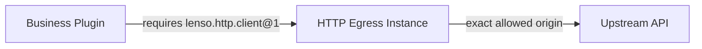

Do not create an ambient HTTP client inside a business Plugin. Declare a
requirement for `lenso.http.client@1`, bind it to one Egress Instance, and make
the granted origins visible in the resolved App.



## 1. Configure exact-origin authority

An allowed origin is only scheme, host, and optional port. Paths, credentials,
queries, and fragments are rejected:

```json title="HTTP Egress Instance configuration"
{
  "allowed_origins": ["https://api.example.test"],
  "max_request_body_bytes": 1048576,
  "max_request_head_bytes": 16384,
  "max_response_body_bytes": 4194304,
  "max_response_head_bytes": 32768,
  "max_concurrent_requests": 64,
  "connect_timeout_millis": 5000,
  "request_timeout_millis": 30000
}
```

`https://api.example.test/v1` is not a valid configured origin. The path is
chosen per request after the exact origin has been admitted.

App Composition must bind the consumer's one `lenso.http.client@1` requirement
to this specific Egress Instance. Linking Egress into the Host does not grant
every Plugin outbound network access.

## 2. Resolve the generated Client once

Resolve `ClientClient` from the Plugin's declared dependencies during
activation and retain it on the provider. Do not rediscover a global client for
each request:

```rust
use lenso_capability_http_client::{ClientClient, ClientInvocationError};
use lenso_kernel::{PluginDependencies, RuntimeFailure};

fn client(dependencies: &PluginDependencies) -> Result<ClientClient, RuntimeFailure> {
    ClientClient::from_dependencies(dependencies)
}
```

## 3. Send one bounded request

```rust
use lenso_capability_http_client::{SendRequest, SendRequestHeadersItem};

async fn create_order(client: &ClientClient) -> Result<i64, ClientInvocationError> {
    let response = client.send(SendRequest {
        method: "POST".into(),
        url: "https://api.example.test/orders".into(),
        headers: vec![SendRequestHeadersItem {
            name: "content-type".into(),
            value: "application/json".into(),
        }],
        body: br#"{"total_cents":4200}"#.as_slice().into(),
    }).await?;
    Ok(response.status)
}
```

The initial provider deliberately has no automatic redirects, retries, system
proxy, Referer, cookie jar, or caller-controlled authority headers. Add
credentials through an explicit Secrets dependency and request header; never
put secret values in immutable Egress configuration.

## 4. Handle failure intentionally

The generated Domain Errors distinguish `destination_not_allowed`,
`invalid_request`, `request_too_large`, `response_too_large`, `timeout`, and
`transport_failure`. Decide at the business boundary whether an operation may
retry; the transport will not repeat a request implicitly.

Test an allowed path, a different path on the same origin, a disallowed origin,
oversized request and response, timeout, redirect response, and cancellation.
Inspect `lenso app show` to prove the exact consumer-to-Egress binding before
shipping.

See [Web Capabilities](/docs/web/web-capabilities) for the complete wire and
error contract.
