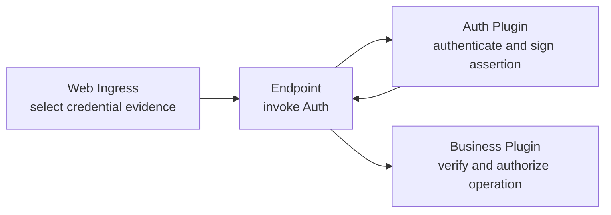

Protecting a route crosses three owners. Keeping them separate prevents a valid
credential from becoming blanket business permission:



## 1. Bind Auth to the Endpoint

The Endpoint provider declares and resolves one `AuthClient` during activation.
App Composition must publish that exact binding. Web Ingress does not discover
an Auth provider and does not make the authentication decision.

Ingress accepts one `Authorization` credential and converts it into
protocol-neutral scheme/value evidence. It removes the credential header before
dispatch, so downstream Plugins receive only the evidence or a sealed
assertion—not ambient HTTP headers.

## 2. Make identity visible in the handler

Define the actor kind your HTTP edge expects and delegate extraction to
`lenso-http-auth`:

```rust title="src/http.rs"
use lenso_auth_sdk::ActorAssertion;
use lenso_capability_http_endpoint::{ExtractorFuture, FromRequest, HandleRequest};
use lenso_http_auth::{AuthenticatedHttpActor, extract_authenticated_actor};
use lenso_kernel::InvocationContext;

struct UserActor { subject: String }

impl AuthenticatedHttpActor for UserActor {
    const KIND: &'static str = "user";

    fn from_assertion(assertion: &ActorAssertion) -> Self {
        Self { subject: assertion.subject().to_owned() }
    }
}

impl FromRequest<OrdersHttp> for UserActor {
    fn from_request<'a>(
        provider: &'a OrdersHttp,
        context: &'a mut InvocationContext,
        request: &'a HandleRequest,
    ) -> ExtractorFuture<'a, Self> {
        extract_authenticated_actor(provider, context, request)
    }
}
```

The provider also implements `AuthClientSource` to return its activation-time
client. The helper converts evidence, calls Auth, emits stable authentication
responses, and attaches the returned assertion to the invocation context.

Use the actor in the route signature so readers can see the authentication
requirement before reading its body:

```rust title="src/http.rs"
#[endpoint]
impl OrdersHttp {
    #[get("orders.read", "/orders/{order_id}")]
    async fn read(
        &self,
        actor: UserActor,
        context: InvocationContext,
        Path(path): Path<OrderPath>,
    ) -> Result<HandleResponse, EndpointHandleInvocationError> {
        self.handle_authenticated(context, actor.subject, path.order_id).await
    }
}
```

## 3. Authorize at the business operation

Authentication answers “who presented acceptable evidence?” The target Plugin
still verifies assertion issuer, Ed25519 proof, validity window, and the exact
audience such as `orders.api@1:read`, then applies tenant, ownership, or role
policy for that operation. It receives a verification key, never the Auth
signing key.

Keep the response mapping intentional:

| Outcome | HTTP result |
| --- | --- |
| Missing, invalid, expired, or revoked credential | `401` with `WWW-Authenticate` |
| Valid actor without permission for the operation | `403` |
| Auth or business Capability unavailable | `503` |

## 4. Prove the boundary

Test at least: no credential, malformed credential, expired/revoked credential,
valid actor, wrong actor kind, wrong operation audience, and valid actor denied
by business policy. Exercise the final cases through a real Ingress socket so
the credential stripping and status mapping are covered.

Continue with [Auth Plugin](/docs/web/auth-plugin) when implementing the
provider, token issuance, revocation, or target-side verifier.
