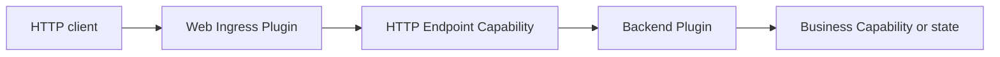

Lenso Web is a backend path built from ordinary Plugins and Capabilities. It is
not a second runtime and it does not add HTTP behavior to the portable Kernel.

## One inbound request

| Owner | Owns | Does not own |
| --- | --- | --- |
| **Web Ingress** | Listener lifecycle, HTTP parsing, immutable route assembly, transport limits, response mapping | Business identity, permissions, or global endpoint discovery |
| **Endpoint Plugin** | Stable route IDs, request decoding, orchestration, intentional responses | Listener sockets or runtime route registration |
| **Auth Plugin** | Authentication evidence and signed actor assertions | The target resource's final authorization decision |
| **Target business Plugin** | Tenant access, roles, ownership, and business rules | HTTP transport policy |

Routes are collected during activation from explicitly bound Endpoint
providers. Duplicate method/path shapes fail readiness instead of changing
behavior after the App starts.

## One outbound request

A backend Plugin requires `lenso.http.client@1`. The selected Egress Instance
owns the exact allowed origins, timeouts, redirect policy, and transfer limits.
There is no ambient network authority or allow-all default.

## Choose the next page by job

<CardGroup>
  <Card title="Build the backend" href="/docs/web/web-endpoint-plugin" description="Start with a typed Endpoint Plugin and direct provider tests." />
  <Card title="Add Web behavior" href="/docs/web/web-capabilities" description="Use inbound routes, OpenAPI, authentication, or outbound HTTP deliberately." />
  <Card title="Understand the core" href="/docs/core/mental-model" description="Learn how Plugin bindings become one immutable execution Plan." />
</CardGroup>
