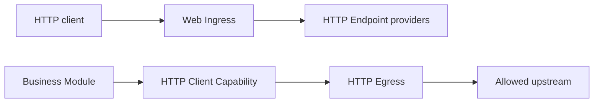

后端 HTTP 由两组相互独立的 Capability 配对组成。入站流量把 Web Ingress 绑定到
一个或多个 `lenso.http.endpoint@1` provider；出站流量把 consumer 绑定到提供
`lenso.http.client@1` 的策略受限 HTTP Egress。



这些后端契约与 App 自己的浏览器 UI 分开。Web Shell、Browser Adapter 与 UI
Contribution Module 负责组合页面和生成的浏览器 client，并不拥有后端 HTTP route。

## 发布入站 Endpoint

使用 endpoint macro，让 `describe` 与 `handle` 共用同一份编译期检查的 route table：

```rust title="src/http.rs"
use lenso_capability_http_endpoint::{
    endpoint, HandleRequest, HandleResponse, HandleResponseHeadersItem,
    EndpointHandleInvocationError,
};
use lenso_kernel::InvocationContext;

#[derive(Clone, Debug, Default)]
struct OrdersHttp;

#[endpoint]
impl OrdersHttp {
    #[post("orders.create", "/orders")]
    async fn create(
        &self,
        _context: InvocationContext,
        _request: HandleRequest,
    ) -> Result<HandleResponse, EndpointHandleInvocationError> {
        Ok(HandleResponse {
            status: 201,
            headers: vec![HandleResponseHeadersItem {
                name: "content-type".into(),
                value: "application/json".into(),
            }],
            body: br#"{"id":"order-42"}"#.as_slice().into(),
        })
    }
}
```

`#[endpoint]` 汇总同一个 `impl` 中的 handler。可使用 `#[get]`、`#[post]`、
`#[put]`、`#[patch]`、`#[delete]`、`#[head]` 与 `#[options]`；每个属性依次声明
稳定 route ID 和 path。旧的 `http_endpoint!` 静态表仍可用于生成代码或兼容已有
Module。

Endpoint 拥有 HTTP 形态的业务行为。Web Ingress 拥有 listener 与协议机制、route
匹配、path parameter、大小与并发限制、deadline、断连 cancel、request ID 以及
稳定的 HTTP error mapping。route 冲突会让 activate 失败。

在 Plan 中为一个 Ingress Instance 设置不可变配置：

```json
{
  "bind_address": "0.0.0.0:8080",
  "max_request_body_bytes": 1048576,
  "max_request_head_bytes": 16384,
  "max_concurrent_requests": 128,
  "request_timeout_millis": 30000
}
```

默认值是临时 loopback listener。Web Ingress 接受一份 `Authorization` credential
作为 evidence，在 invocation 前移除 credential 与 hop-by-hop header，并替换不可信
的外部 request ID。目标 Auth 和业务 Module 仍分别拥有 authentication 与最终授权。

## 调用上游服务

HTTP Egress 至少需要一个精确的 `http` 或 `https` origin。`allowed_origins` 中不能
包含 path、credential、query 或 fragment。

```rust
use lenso_http_egress::HttpEgressConfig;
use std::time::Duration;

let config = HttpEgressConfig::new(["https://api.example.test"])?
    .with_transfer_limits(1024 * 1024, 16 * 1024, 4 * 1024 * 1024, 32 * 1024)?
    .with_max_concurrent_requests(64)?
    .with_timeouts(Duration::from_secs(5), Duration::from_secs(30))?;
```

从 consumer 已声明并绑定的 dependencies 解析生成 client：

```rust
use lenso_capability_http_client::{
    ClientClient, ClientInvocationError, SendRequest, SendRequestHeadersItem,
};
use lenso_kernel::{ModuleDependencies, RuntimeFailure};

fn client(dependencies: &ModuleDependencies) -> Result<ClientClient, RuntimeFailure> {
    ClientClient::from_dependencies(dependencies)
}

async fn send(client: &ClientClient) -> Result<i64, ClientInvocationError> {
    let response = client.send(SendRequest {
        method: "POST".into(),
        url: "https://api.example.test/orders".into(),
        headers: vec![SendRequestHeadersItem {
            name: "content-type".into(),
            value: "application/json".into(),
        }],
        body: br#"{"total_cents":4200}"#.as_slice().into(),
    }).await?;
    Ok(response.status)
}
```

生成的 Domain Error 包括 `destination_not_allowed`、`invalid_request`、
`request_too_large`、`response_too_large`、`timeout` 与 `transport_failure`。
当前 provider 不会自动跟随 redirect、使用 system proxy、管理 cookie 或重试。

两个 HTTP contract 都是 portable 的，并有生成的 TypeScript binding。但当前维护的
Ingress 与 Egress provider 是 linked Rust Module；Bun Module 仍需通过 host 支持的
execution path 与 binding 获得 Capability。contract portable 不等于 provider 自动安装。
