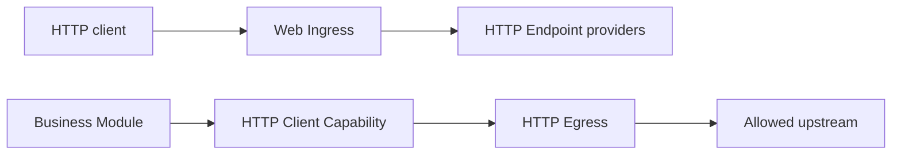

后端 HTTP 由两组相互独立的 Capability 配对组成。入站流量把 Web Ingress 绑定到
一个或多个 `lenso.http.endpoint@1` provider；出站流量把 consumer 绑定到提供
`lenso.http.client@1` 的策略受限 HTTP Egress。



这些后端契约与 App 自己的浏览器 UI 分开。Web Shell、Browser Adapter 与 UI
Contribution Module 负责组合页面和生成的浏览器 client，并不拥有后端 HTTP route。

## 发布入站 Endpoint

使用 endpoint macro，让 `describe` 与 `handle` 共用同一份编译期检查的 route table：

```rust title="src/http.rs"
use lenso_capability_http_endpoint::{
    endpoint, HandleResponse, EndpointHandleInvocationError, Json,
    response::{self, HeaderValue, StatusCode, header},
};
use lenso_kernel::InvocationContext;
use serde::{Deserialize, Serialize};

#[derive(Deserialize)]
struct CreateOrder {
    total_cents: u64,
}

#[derive(Serialize)]
struct CreatedOrder<'a> {
    id: &'a str,
}

#[derive(Clone, Debug, Default)]
struct OrdersHttp;

#[endpoint]
impl OrdersHttp {
    #[post("orders.create", "/orders")]
    async fn create(
        &self,
        _context: InvocationContext,
        Json(_order): Json<CreateOrder>,
    ) -> Result<HandleResponse, EndpointHandleInvocationError> {
        Ok(response::json(
            StatusCode::CREATED,
            &CreatedOrder { id: "order-42" },
        )?.with_header(
            &header::LOCATION,
            &HeaderValue::from_static("/orders/order-42"),
        )?)
    }
}
```

`#[endpoint]` 汇总同一个 `impl` 中的 handler。可使用 `#[get]`、`#[post]`、
`#[put]`、`#[patch]`、`#[delete]`、`#[head]` 与 `#[options]`；每个属性依次声明
稳定 route ID 和 path。旧的 `http_endpoint!` 静态表仍可用于生成代码或兼容已有
Module。

Endpoint 拥有 HTTP 形态的业务行为。Web Ingress 拥有 listener 与协议机制、route
匹配、path parameter、大小与并发限制、deadline、断连 cancel、request ID 以及
稳定的 HTTP error mapping。route 冲突会让 activate 失败。

常规响应使用 `response::json`、`response::problem`、`response::text` 和
`response::empty`。它们接收强类型状态码、设置正确的 content type，并让序列化失败
继续走 Endpoint error path。需要 `Location`、`WWW-Authenticate` 或其他显式 header
时，使用接收已校验 `http` header name/value 的 `HandleResponse::with_header`。只有
少见的二进制响应体才需要直接构造生成的 wire DTO。

## 对入站请求进行认证

Web Ingress 从一个 `Authorization` header 中选出 credential，并把 scheme 与 value
放入 `HandleRequest::credential`；它本身不会认证调用者。Endpoint 在 activate 时解析
显式绑定的 `AuthClient`，提交与协议无关的 evidence，再把 Auth 返回的
`ActorAssertion` 附加到 invocation context，然后调用业务 Capability：

```rust title="src/http.rs"
use std::rc::Rc;

use lenso_auth_sdk::ActorAssertion;
use lenso_capability_auth::AuthClient;
use lenso_capability_http_endpoint::{
    EndpointHandleInvocationError, ExtractorFuture, FromRequest,
    HandleRequest, HandleResponse, Path, endpoint,
};
use lenso_http_auth::{
    AuthClientSource, AuthenticatedHttpActor, extract_authenticated_actor,
};
use lenso_kernel::InvocationContext;
use serde::Deserialize;

#[derive(Deserialize)]
struct OrderPath {
    order_id: String,
}

struct UserActor {
    subject: String,
}

impl AuthenticatedHttpActor for UserActor {
    const KIND: &'static str = "user";

    fn from_assertion(assertion: &ActorAssertion) -> Self {
        Self { subject: assertion.subject().to_owned() }
    }
}

impl AuthClientSource for OrdersHttp {
    fn auth_client(&self) -> Result<Rc<AuthClient>, EndpointHandleInvocationError> {
        Ok(self.auth.clone())
    }
}

impl FromRequest<OrdersHttp> for UserActor {
    fn from_request<'a>(
        provider: &'a OrdersHttp,
        context: &'a mut InvocationContext,
        request: &'a HandleRequest,
    ) -> ExtractorFuture<'a, Self> {
        extract_authenticated_actor(provider, context, request)
    }
}

#[endpoint]
impl OrdersHttp {
    #[get("orders.read", "/orders/{order_id}")]
    async fn read(
        &self,
        actor: UserActor,
        context: InvocationContext,
        Path(path): Path<OrderPath>,
    ) -> Result<HandleResponse, EndpointHandleInvocationError> {
        self.handle_authenticated(context, actor.subject, path.order_id).await
    }
}
```

`extract_authenticated_actor` 统一处理 evidence 转换、Auth 调用、稳定的 `401`/`403` 响应以及
assertion 附加。`OrdersHttp::auth` 与 Orders client 是从 `ActivateContext::dependencies()` 一次性创建、
并在 deactivate 时释放的 client；不要在每个请求里重复解析 binding。目标 Orders
Module 仍必须校验 assertion 的 proof、issuer、有效期和 operation audience，然后再投影
为自己的 typed actor。Provider 与目标侧的完整代码见 [Auth Module](/docs/zh/auth-module/)。

extractor 按 handler 参数顺序运行。它可以等待 provider 上保存的 client、为后续
extractor 和 handler 增强 context、返回明确响应，或保留 Endpoint failure。内置
extractor 包括 `Path<T>`、`Query<T>`、`Json<T>` 与 `RequestId`。无效 path、query
或 JSON 会在 handler 运行前被拒绝。

middleware 更适合自然包裹多个 handler 参数的行为，例如 tracing 或共享响应策略。
认证通常更适合 `UserActor` 或 `AdminActor` extractor，因为 handler 签名会直接显示
期望的身份类型。这些是应用自己实现 `AuthenticatedHttpActor` 的 HTTP 入口身份类型；
Lenso 不强加一套通用 user 模型。它与目标侧验证后才投影的 `TypedActor` 有意分开。
`AdminActor` 只应该表示一种不同的、已经认证的 actor kind，不应借 extractor
直接授予角色、tenant access 或 resource ownership；这些决定仍属于目标 Module。

`handle_authenticated` 是 Endpoint 自己的应用代码：它携带上述 assertion context
调用 `self.orders`，用 `response::json` 序列化成功结果，并把目标 Module 的授权拒绝
显式映射成 `403` Problem Details。

请显式保持以下映射：

| 结果 | Endpoint 响应 |
| --- | --- |
| credential 缺失、无效、过期或已撤销 | `401` Problem Details 和 `WWW-Authenticate` |
| actor 有效，但无权调用目标 operation | Endpoint 把目标 Module 的授权拒绝映射为 `403` |
| path、query 或 body 格式错误 | `400` |
| JSON extractor 缺少 content type 或 content type 不受支持 | `415` |
| Auth 或业务 Capability 不可用 | `503` |
| response 序列化或 header 构造失败 | Endpoint internal failure，映射为 `503` |

Ingress 拥有 transport error；Auth 拥有 evidence authentication；目标业务 Module
拥有最终授权。Auth 成功不等于获得所有业务权限。

在 Plan 中为一个 Ingress Instance 设置不可变配置：

```json
{
  "bind_address": "0.0.0.0:8080",
  "max_request_body_bytes": 1048576,
  "max_request_head_bytes": 16384,
  "max_concurrent_requests": 128,
  "request_timeout_millis": 30000
}
```

默认值是临时 loopback listener。Web Ingress 会在 invocation 前移除 credential 与
hop-by-hop header，并替换不可信的外部 request ID。

## 调用上游服务

HTTP Egress 至少需要一个精确的 `http` 或 `https` origin。`allowed_origins` 中不能
包含 path、credential、query 或 fragment。

```rust
use lenso_http_egress::HttpEgressConfig;
use std::time::Duration;

let config = HttpEgressConfig::new(["https://api.example.test"])?
    .with_transfer_limits(1024 * 1024, 16 * 1024, 4 * 1024 * 1024, 32 * 1024)?
    .with_max_concurrent_requests(64)?
    .with_timeouts(Duration::from_secs(5), Duration::from_secs(30))?;
```

从 consumer 已声明并绑定的 dependencies 解析生成 client：

```rust
use lenso_capability_http_client::{
    ClientClient, ClientInvocationError, SendRequest, SendRequestHeadersItem,
};
use lenso_kernel::{ModuleDependencies, RuntimeFailure};

fn client(dependencies: &ModuleDependencies) -> Result<ClientClient, RuntimeFailure> {
    ClientClient::from_dependencies(dependencies)
}

async fn send(client: &ClientClient) -> Result<i64, ClientInvocationError> {
    let response = client.send(SendRequest {
        method: "POST".into(),
        url: "https://api.example.test/orders".into(),
        headers: vec![SendRequestHeadersItem {
            name: "content-type".into(),
            value: "application/json".into(),
        }],
        body: br#"{"total_cents":4200}"#.as_slice().into(),
    }).await?;
    Ok(response.status)
}
```

生成的 Domain Error 包括 `destination_not_allowed`、`invalid_request`、
`request_too_large`、`response_too_large`、`timeout` 与 `transport_failure`。
当前 provider 不会自动跟随 redirect、使用 system proxy、管理 cookie 或重试。

两个 HTTP contract 都是 portable 的，并有生成的 TypeScript binding。但当前维护的
Ingress 与 Egress provider 是 linked Rust Module；Bun Module 仍需通过 host 支持的
execution path 与 binding 获得 Capability。contract portable 不等于 provider 自动安装。
