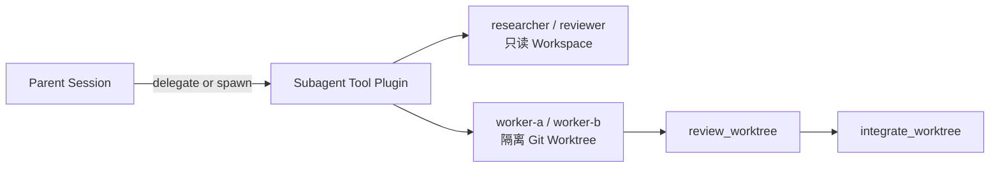

官方 `code` 与 `code-sandbox` Profile 已包含有边界的 Child Agent。Parent 保持控制：
Child 作为 Tool Target 被选择，获得新的持久 Session，并返回有边界的结果。这不是
Handoff，也不是共享上下文的群聊。

## 选择最小委派方式

| 需求 | Tool | 生命周期 |
| --- | --- | --- |
| 继续前先得到一个有边界的答案 | `delegate` | 在一次调用中等待并返回结果 |
| Parent 做其他事情时继续工作 | `spawn_subagent` | 返回 Task ID |
| 不消费结果地观察状态 | `list_subagents` | 稳定、非阻塞 Snapshot |
| 收集终态结果并释放 Slot | `wait_subagent` | 消费结果 |
| 在下一个 Model Boundary 补充方向 | `send_subagent` | 持久记录已接纳输入 |
| 停止 Detached Work | `cancel_subagent` | 请求取消 |

可用 Child 名称来自不可变 Plan。官方 Coding Profile 当前提供只读的 `researcher`、
`reviewer`，以及可写的 `worker-a`、`worker-b` Lane。

## 理解权限边界

只读 Child 使用受限 Tool 集合。Root 的写入与 Process 权限不会自动传给 Child。
每个 Child 都会新建 Session，而不是继承 Parent 的完整 Transcript。

可写 Worker 会先在 Agent Home Runtime 目录下获得独立 Git Worktree。Workspace
Read、Edit、Process 与 Git Provider 都使用同一个 Scoped Path；Parent Workspace
保持不变。

## 集成前审查写入

Child 完成不等于代码已经合并。Parent 需要经过单独的审查流程：

1. `list_worktrees` 查找保留的 Allocation。
2. `review_worktree` 要求 Child Checkout 干净，并锁定准确 HEAD 与 Diff Digest。
3. `integrate_worktree` 再次验证审查结果，要求 Parent Workspace 干净，然后执行
   Non-fast-forward Merge。

Dirty、审查后变化、冲突与超容量状态都会 Fail Closed；不会隐式 Force Cleanup 或
自动解决冲突。

## 分清哪些状态可持久恢复

Child Session 是持久执行记录。Task Handle 与 Allocation Registry 属于当前
Generation，不承诺在 Host Suspend 或 Generation 切换后恢复。`list_subagents`
不会消费终态结果；只有 `wait_subagent` 会释放 Task Slot。

如果只需要只读规划，直接选择 `plan` Profile，不要创建 Child Task。参见
[Profile 与 Tool](/docs/zh/agent/profiles-and-tools)。
