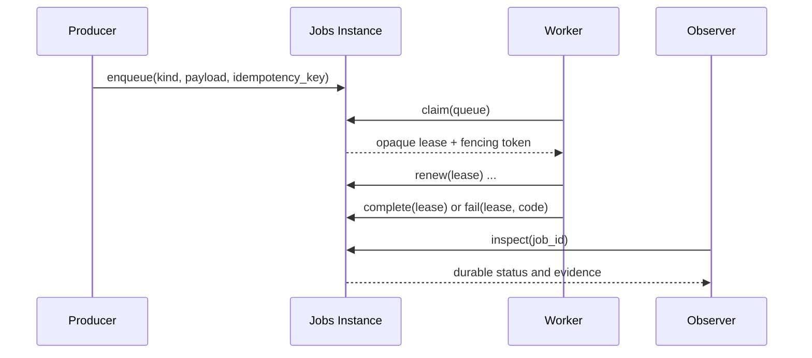

本指南覆盖位于 [`LioRael/lenso-jobs-plugin`](https://github.com/LioRael/lenso-jobs-plugin)
的第一方 Durable Jobs Plugin。它只教授一条有边界的路径：有授权的 Producer Enqueue 一个
类型化 Job；有授权的 Worker 在 Lease 下 Claim；Observer Inspect Durable Result。Jobs Module
持有 Queue 与 Lease State；消费它的业务 Module 持有 Payload Meaning 与所有 External Effect。

## 任务地图

| 结果 | 前置条件 | 所有者与当前 Availability | 可观察成功 | 预期失败 | 下一页 |
| --- | --- | --- | --- | --- | --- |
| Enqueue 一个类型化 Job | Host 选择的 Jobs Instance 已准备私有 PostgreSQL Schema、允许的 Producer Instance，以及 Caller-scoped Idempotency Key | Jobs 持有 Queue Placement 与 Availability Time；业务 Module 持有 Payload Schema 与 Meaning；准确 Availability 取决于 Host Composition | `enqueue` 接受 Job，Observer 随后可以 Inspect Durable Identity | Caller 未授权、相同 Key 对应不同 Intent，或 Schema Readiness 失败 | [受支持的工作流](/docs/zh/core/supported-workflows) |
| Claim、Renew、Complete、Fail 并恢复一个 Job | 允许的 Worker Instance，以及 `claim` 返回的 Opaque Lease | Jobs 持有 Attempt Count、Lease Generation、Expiry、Retry Schedule 与 Terminal Status；Worker 必须让 External Effect 具备 Idempotency | `complete` 记录成功，或 `fail` 记录 Retryable/Non-retryable Evidence；过期 Lease 用新的 Fencing Token 回收 | Expired/Fenced Lease 无法 Complete、Worker 丢失导致 Reclaim，或有界 Retry 进入 Terminal Failure | [Inspect 一个 Job](/docs/zh/core/jobs) |
| Inspect Durable Evidence | 允许的 Observer Instance 与 Jobs Capability Binding | Jobs 持有 Stable Status 与 Last Failure Code；PostgreSQL 是私有 Persistence Adapter | `inspect` 显示 Identity、Queue、Attempt、Lease/Retry State 与 Terminal Evidence，但不改变 Job | Observer 未授权，或 Preparation 期间 Schema 不可用 | [仓库地图](/docs/zh/core/repository-map) |

源代码仓库是这份 Capability Contract 的证据。本页不承诺新的公开 Package、Shared Database
或 Hosted Queue。Producer 与 Worker 使用前，Host 必须选择并准备 Jobs Instance。

## 1. 定义一个 Jobs Instance

每个 Keyed Jobs Instance 声明允许的 Queue 与 Caller Instance。当 Queue 跨越 Trust 或
Operational Boundary 时，应使用不同 Instance。Owner README 中的代表性配置如下：

```json
{
  "schema": "jobs_email",
  "database_url_secret": "jobs/database-url",
  "lease_seconds": 30,
  "retry_base_seconds": 5,
  "retry_max_seconds": 300,
  "queues": ["email"],
  "producer_instances": ["accounts", "organization"],
  "worker_instances": ["email-worker"],
  "observer_instances": ["operations"]
}
```

Database URL 位于显式绑定的 Secrets Capability 后。PostgreSQL 是私有 Persistence Adapter；
Setup 与 Upgrade 是明确的 Operator Workflow。Module 在 `prepare` 期间验证 Schema，Factory
验证后 Configuration 保持不可变。

## 2. 生产一个类型化 Job

可移植的 `lenso.jobs@1` Capability 提供 `enqueue`、`claim`、`renew`、`complete`、`fail` 与
`inspect`。消费它的业务 Module 选择 Job Kind 并持有 Payload Schema。Jobs Module 只持有这些
Durable Control Field：

- Job Identity、Queue Placement 与 Availability Time；
- Attempt Count、Lease Generation 与 Lease Expiry；
- Retry Schedule 与 Terminal Status；
- Last Stable Failure Code。

使用 Caller-scoped Idempotency Key Enqueue。如果 Producer 在 Transport Result 不明确时重试，
可以重复相同 Intent，而不会产生无界 Duplicate。Enqueue 的 Idempotency 不会让 Email、Payment
或其他 External Effect 自动安全；Worker 的业务代码还必须让每个 Effect 自身具备 Idempotency。

## 3. Claim 并 Fence 一次 Worker Attempt

Worker 为允许的 Queue 调用 `claim`，并获得 Opaque Lease。Lease 不带有 Browser 或 Caller 可以
伪造的业务 Authority。Worker 可以在处理期间 `renew`，然后 `complete` 或 `fail`。



过期 Lease 永远不能 Complete Job。之后的 Worker 可以带新的 Fencing Token 回收它。这可以
阻止延迟的第一个 Worker 在 Job 已重新分配后发布过期 Success。处理过程按 At-least-once
理解：业务 Module 必须通过自己的 Idempotency Key 或 Deduplication Boundary 保护 External Effect。

## 4. 恢复 Failure 与 Retry

`fail` 记录 Error 是否 Retryable 或 Terminal。Retryable Failure 使用有界的
`retry_base_seconds` 与 `retry_max_seconds` Policy。Attempt Budget 耗尽后，Job 进入 Terminal，
并保留 Last Stable Failure Code 供 Inspect。Worker Crash 或 Lease Expiry 走同一个 Reclaim
路径；它不算 Successful Completion。

| Evidence | 所有者响应 |
| --- | --- |
| Lease Expired 或 Fencing Token Stale | 拒绝 Completion；使用新的 Lease 与 Fencing Token Reclaim |
| Temporary Business Failure | 记录 Retryable `fail`，等待有界 Retry Schedule |
| Permanent Business Failure | 记录 Non-retryable `fail`，保留 Terminal Evidence |
| Crash 前 External Effect 可能已经发生 | 重试前通过业务 Module 的 Idempotency 或 Deduplication Boundary 对账 |

## 5. Inspect 一个 Job

允许的 Observer 调用 `inspect` 读取 Durable Evidence，而不改变 Job。至少应能据此识别 Job 与
Queue，看到 Attempt 与 Lease/Retry State，并读取 Terminal Status 或 Last Stable Failure Code。
Observer 不会成为 Worker，也不能 Complete 另一个 Instance 的 Lease。

当 Host 无法解析 Jobs Instance 或其 Secrets/Database Binding 时，使用[检查与排障 App](/docs/zh/core/inspect-an-app)。
当拟议变更从 Queue Mechanics 越过到 Business Payload 或 External-effect Ownership 时，使用[仓库地图](/docs/zh/core/repository-map)。

## 此 Contract 明确延后

第一版 Jobs Slice 刻意保持单步。它不包含 Recurring Schedule、Priority、Cancellation、Progress
Stream、Workflow Graph、Business Handler Implementation、External-effect Idempotency、Kernel
Scheduling 或 Web/Console Surface。只有在真实 Consumer 提供 Owner Contract 与 Evidence 后才添加
这些内容；不要从 `enqueue` 与 `claim` 的存在推断它们已经可用。
