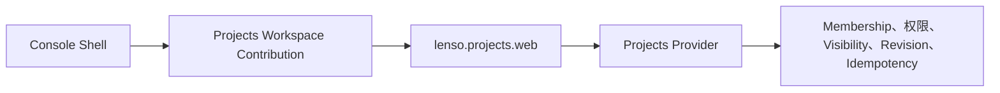

这条路径描述由
[`LioRael/lenso-projects-web-plugin`](https://github.com/LioRael/lenso-projects-web-plugin)
持有的 Projects 集成。它覆盖 Console Workspace Contribution 与经过认证的 Web Contract。
Web Plugin 是 Linked Native Plugin，不是 Portable Bundle，也不是独立 HTTP Server；Host
必须显式组合它。

## 任务地图

| 结果 | 前置条件 | 所有者与当前 Availability | 可观察成功 | 预期失败 | 下一页 |
| --- | --- | --- | --- | --- | --- |
| 打开有授权的 Workspace | Host 链接 Web 与 Workspace Plugin、绑定 Projects Provider 与 Organization Directory、已登录用户，以及有效 Membership | Console 持有 Shell Placement 与 Selected-Workspace Context；Projects Provider 持有 Membership 与 Visibility；当前集成是 Git-distributed/source-first | `/api/projects/workspaces` 返回已认证 Membership，单个 Workspace 自动打开，**Switch workspace** 返回 Selector | Directory Binding 缺失、登录过期、`401`、`403` 或保护 Visibility 的 `404` | [检查 App](/docs/zh/core/inspect-an-app) |
| 读取或创建 Project 或 Issue | 已授权的 Selected Organization、对应 Projects Capability Binding，以及 Session Cookie 或受支持的 Credential | Web Plugin 将 HTTP 映射到 Projects Capability；Provider 持有事实、权限、Revision 与 Idempotency | Roadmap/Project Detail 或 Issue Queue 加载；有权限的 Create 或 Update 返回 Record 并可再次读取 | Actor Kind 错误 `403`、隐藏 Resource `404`、Revision/Idempotency 冲突 `409`，或无效请求 `400` | [Jobs：Producer 与 Worker 边界](/docs/zh/core/jobs) |

源代码仓库是这条路径的证据。Workspace Package 通过 Git 分发，UI Contract 尚未发布；业务
Web Crate 有自己的 Release 边界。不要把 Source Checkout 写成公开 npm、crates.io 或
Hosted Service Availability 承诺。

## 1. 选择 Workspace

Console Entry 通过 `/api/projects/workspaces` 列出已认证用户的 Active Membership。恰好只有
一个时会自动打开；有多个时，**Switch workspace** 返回 Selector。Organization ID 来自已认证
Membership List，而不是自由输入。

Consuming App 必须绑定 Organization Directory Port，并允许 Projects Web Instance 作为
Directory Caller。当前 Source Integration 需要 Organization Directory descriptor 1.1.0 与
匹配的 PostgreSQL Provider。在该依赖发布前，Owner README 描述了使用 Repository-relative
Cargo Patch 的 Source Checkout 验证方式。

Selector 只能证明 Membership Discovery，不能证明 Record Access。Selected Organization 仍
需要经过授权的 Team、Project Capability。

## 2. 理解组合边界

Projects Web Plugin 提供 `lenso.http.endpoint@1`，并把 Project、Issue、Comment、Update 与
Catalog Fact 委托给绑定的 Projects Capability。Host 必须：

1. 链接 Native Crate，并使用 Linked Factory 构建 Registry；
2. 将 `lenso.projects.web` 放入 Resolved App Plan；
3. 绑定其 Auth、Projects、Projects Collaboration 与 Projects Admin Requirement；
4. 将 Host 的 Web Ingress `many lenso.http.endpoint@1` Requirement 绑定到该 Plugin。

Console Host 还可以接纳 `lenso.console.workspace.projects`，它持有 `projects` Workspace
Contribution 与 Fixed-Operation Business Adapter。单独安装业务 Web Crate 不会增加 Console
Navigation。

Console 持有 Primary Rail、Context Sidebar、Theme、Footer 与 Mini Agent。Workspace 只在该
Shell 中渲染 Projects 内容。同进程 Workspace 可以使用 Request-scoped Signed Assertion；
明确外部的 Business App 使用独立、短时的 Delegated Grant。独立 Agent Business Connection
不会默默与 Workspace 共享。

## 3. 读取 Projects Surface

当前 Product Surface 包括：

- Project：List、Create、Read、Update、Archive；
- Issue：List、Create、Read、Update、Move、Archive；
- Comment：List、Add、Update、Delete；
- Project Update：List、Create；
- Read-only Catalog：Team、Status、Workflow State、Cycle、Milestone 与 Label。

Browser 使用 App 已有的 HttpOnly `session` Cookie，或 Host 支持的 Credential Protocol。页面
不会要求 JavaScript 存储 Bearer Token。对于 Session-authenticated Mutation，Host 选择
`session` Evidence 并转发准确 Origin；缺失或不匹配的 Origin 会 Fail Closed。

Web Plugin 不会持久化、重建、缓存或独立授权这些 Fact。它通过恰好一个 `lenso.auth@1`
认证 Ingress Evidence，附加得到的 `ActorAssertion`，再使用 `_with_context` 调用目标
Capability。

## 4. 创建或读取一条 Record

从 Selected Organization 开始，使用正常 Projects View。有权限的 Project 或 Issue Mutation
成功后，会返回 Provider 接受的 Record；再从 Issue Queue 或 Project Detail 读取一次，以证明
写入已在所有者边界持久化。

| Response | 含义 | 恢复方式 |
| --- | --- | --- |
| `401` | Credential 缺失或无效 | 通过 App-owned Login Route 重新登录，并保留已验证的同源 Return Path |
| `403` | Actor Kind 不允许该 Operation | 使用受支持的 User/Actor Identity；不要扩大 Web Plugin Authority |
| `404` | Resource 缺失，或被 Private-Team Visibility 隐藏 | 检查 Selected Membership 与 Organization；不要推断 Private Resource 是否存在 |
| `409` | Revision 或 Idempotency 冲突 | 刷新 Provider State，选择显式 Revision，或对相同 Intent 重用相同 Idempotency Key |
| `400` | Request 无效 | 修正类型化 Request 后再重试 |

Membership、Permission、Private-Team Visibility、Revision Check 与 Idempotency 都由 Provider
决定。Browser Route 或 Console Workspace 不能通过拼接不完整的 Project/Team List 绕过这些检查。

## 5. 了解 Source-only 与延后内容

可选的 `chrome.Sidebar` Component 会在已有 Context Sidebar 内提供 Plugin-owned Navigation；
较旧 Host 使用 Page-header Workspace Menu。两种路径都不会给 Projects Plugin 第二套 Application
Shell、任意 Proxy 或新的 Credential Authority。

当前集成不承诺独立 Console 产品、Shared Database、Generic Managed Service 或公开 UI Package，
也不会把 Source Delivery 变成新的 npm 或 crates.io Release。需要 Durable Single-step Background
Boundary 时，继续阅读[运行一个 Durable Job](/docs/zh/core/jobs)。
