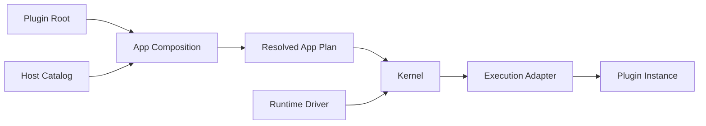

理解其余框架内容只需要六个概念。假设我们有一个 Agent App，并希望它可以调用
`uppercase` Tool。

| 概念 | 例子中的对应物 | 职责 |
| --- | --- | --- |
| **App** | 完整的 Agent 产品 | App Owner 想要运行的全部行为。 |
| **Plugin** | `company.uppercase` | 一个可移除的产品行为单元。 |
| **Capability** | `lenso.agent.tool-provider@1` | Plugin 之间协作的类型化角色。 |
| **Plugin Instance** | `company.uppercase/default` | 一个经过配置的 Plugin 选择。 |
| **Host** | Agent 可执行程序 | 提供允许使用的 Plugin inventory 与 Host 机制。 |
| **Resolved App Plan** | 被接受的精确图 | Kernel 消费的不可变执行输入。 |

## 从开发选择到运行行为

App Owner 修改可见的 Plugin 选择与配置。Composition 会根据 Host Catalog 解析这些
选择；缺少 Capability 或绑定不明确时，它会在启动前失败。Kernel 只接收已经通过
校验的 Plan，不会在运行时发现 Plugin 或自行修复执行图。

## Capability 是角色，不是实现

Agent Loop 需要 Tool Provider Capability。`uppercase` Plugin 是这个角色的一种实现。
另一个 Plugin 可以提供同一份 Contract，而 App Composition 会在启动前选择精确绑定。

因此行为才可以被替换：消费者依赖 Capability，App 持有实现选择权。

## 下一步

<CardGroup>
  <Card title="修改第一个 App" href="/docs/zh/core/first-app-change" description="让 Plugin Bundle 经过真实 Host 与可逆 Plugin Root 改动。" />
  <Card title="什么是 Plugin？" href="/docs/zh/core/plugins-and-capabilities" description="详细理解 Package、Implementation、Instance 与 Connection 的边界。" />
  <Card title="向 App 添加 Plugin" href="/docs/zh/core/plugin-composition" description="修改一个可见 Plugin Root，并检查解析结果。" />
  <Card title="核心架构" href="/docs/zh/core/architecture" description="理解 Authoring 工作流之下稳定的所有权边界。" />
</CardGroup>
