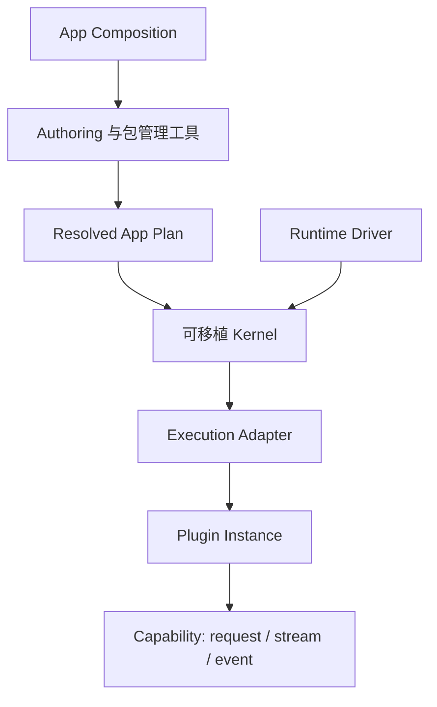

## 从一个结果开始

<CardGroup>
  <Card title="创建第一个 Plugin" href="/docs/zh/core/quickstart" description="安装 CLI，运行一个类型化 Plugin，并验证可分发 Bundle。" />
  <Card title="学习心智模型" href="/docs/zh/core/mental-model" description="通过一个例子理解 App、Plugin、Capability、Host、Plan 与 Kernel。" />
  <Card title="修改第一个 App" href="/docs/zh/core/first-app-change" description="初始化 Host Workspace、加入 Bundle、检查 Derived App、运行并移除改动。" />
</CardGroup>

## 用可替换 Plugin 构建产品

Lenso 是一个本地优先、语言无关的产品运行时，适用于需要持续添加、替换与移除
行为，同时又不希望组合逻辑变成框架黑盒的应用。

将产品角色定义为类型化 Capability，用 Plugin 实现这些角色，再由 Host 在启动前
解析出一个精确应用。开发者与 Coding Agent 面对同一份可检查 Plugin Root，运行时
则让生命周期、失败语义与执行选择保持显式。

Lenso 适合长期演进的业务系统、开发者工具、自动化产品与 Agent 应用。它不是
Web 框架，也不是分布式控制平面。

<CardGroup>
  <Card title="创建第一个 Plugin" href="/docs/zh/core/quickstart" description="安装 CLI，运行一个类型化 Plugin，并验证可分发 Bundle。" />
  <Card title="查看当前实现范围" href="/docs/zh/core/status-and-scope" description="区分稳定、Early-access 与刻意延后的能力。" />
</CardGroup>

## 为什么需要 Lenso

在长期演进的产品中，一个功能很少只存在于一个文件里。它的配置、状态、权限、
后台任务与失败策略会逐渐散落到整个应用。此后再移除或替换它就充满风险，Coding
Agent 也只能猜测系统从未明确记录的边界。

Lenso 让这些产品边界可以被执行和验证：

- **Plugin 持有产品行为。** 移除 Plugin，也移除它带来的产品复杂度。
- **Capability 定义协作。** 消费方依赖类型化角色，而不是实现方的私有代码或传输。
- **Plugin Root 表达意图。** App Owner 修改可见的 Plugin 选择与配置，无需手写运行图。
- **解析在启动前失败。** 不兼容或有歧义的选择不会变成只启动了一半的应用。

Lenso 将这些责任分开：

- **Composition** 选择 Plugin、绑定 Capability，并生成 Plan。
- **Kernel** 使用可移植的生命周期规则校验并执行 Plan。
- **Runtime Driver** 提供调度、时钟、取消与关闭。
- **Execution Adapter** 把 Kernel 连接到具体的 Plugin 实现。
- **Plugin** 通过类型化 Capability Interface 持有产品行为。

这种拆分让应用结构在执行前即可检查，同时避免宿主机制进入可移植核心。

## 运行时模型

Plan 是完整的执行输入。它记录 Plugin 身份、Capability 绑定、Execution Class、
连接、策略，以及应用准入所需的数据。Plan 解析完成后保持不可变；Kernel 不会
在启动期间发现或改写运行图。

Kernel 持有图校验、分阶段生命周期、就绪门、调用、取消、监督和有界诊断；
它不持有网络、文件系统、数据库、进程、Auth、遥测、Console 或业务语义。

## 核心概念

| 概念 | 职责 |
| --- | --- |
| **App Composition** | 声明应用并选择兼容实现。 |
| **Resolved App Plan** | 提供运行时接受的规范化、不可变输入。 |
| **Capability** | 定义带版本的 Interface，以及 request、stream 或 event Operation。 |
| **Plugin** | 实现产品行为，并声明它提供或依赖的 Capability。 |
| **Kernel** | 持有可移植的准入、生命周期、调用、取消和诊断。 |
| **Runtime Driver** | 提供宿主调度、时间、任务 join、取消和关闭。 |
| **Execution Adapter** | 在具体环境或传输机制中运行 Plugin 实现。 |

## 可移植不等于没有环境差异

相同的 Kernel 语义可以编译到 Native、浏览器 JavaScript 与 WASIp2 宿主配置。
每个配置仍然需要 Driver 与兼容的 Execution Adapter。可移植表示 Kernel 不会
吸收这些宿主机制，并不表示每个 Plugin 都能在所有环境中原样运行。

## 当前实现边界

- `lenso-app-plan` 持有可序列化执行输入。
- `lenso-kernel` 持有可移植运行时语义与确定性 conformance。
- `lenso-runtime-conformance` 持有产品无关的运行时验证。
- Driver、Execution Adapter、协议、可选 Plugin、Authoring 与示例分别位于
  独立的所有者仓库。
- 运行时 discovery、hot graph mutation、distributed placement、自动副本与
  独立 Console 产品都不是当前运行时承诺。

在[状态与范围](/docs/zh/core/status-and-scope)中查看已实现、Early-access 与刻意延后
边界的准确说明。

## 下一步

<CardGroup>
  <Card title="选择 Plugin 开发路径" href="/docs/zh/core/choose-plugin-path" description="比较可移植 Rust、Linked Rust 与 Bun，并区分开发路径和交互形态。" />
  <Card title="向 App 添加 Plugin" href="/docs/zh/core/plugin-composition" description="修改一个可见 Plugin Root，并检查精确解析结果。" />
  <Card title="编写 Capability" href="/docs/zh/core/capability-authoring" description="定义 Request、Stream 与 Event Contract，并生成各自拥有的语言 Projection。" />
  <Card title="理解运行时" href="/docs/zh/core/architecture" description="理解 Composition、Kernel、Driver 与 Adapter 的所有权边界。" />
  <Card title="检查失败的 App" href="/docs/zh/core/inspect-an-app" description="使用 doctor、list、show 与 check 定位设置、组合和运行时故障。" />
  <Card title="构建 Web 后端" href="/docs/zh/web" description="沿独立 Web 路径从 Endpoint Plugin 走到真实 Socket。" />
  <Card title="构建 Agent 产品" href="/docs/zh/agent" description="运行维护中的 Agent，选择 Profile，并增加一个 Tool。" />
</CardGroup>
