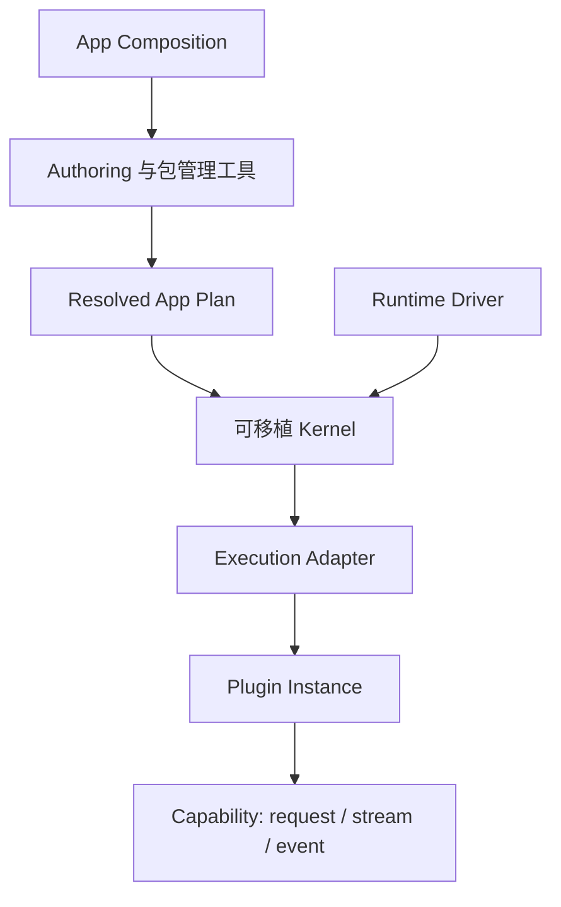

Lenso 是一个面向模块化应用的本地优先、语言无关运行时。它把应用的 Plugin、
Capability 绑定、执行选择与策略解析成不可变的 **Resolved App Plan**，再由一个
小型可移植 Kernel 执行该 Plan。

核心思想很直接：在启动前决定应用结构，让运行时语义保持显式，并把环境相关
工作留在宿主边界。

## 为什么需要 Lenso

模块化系统经常难以推理，是因为组合、运行时调度、传输、基础设施和产品行为
被挤在同一层。最终往往形成隐式依赖发现、随环境变化的生命周期，以及必须等
应用运行后才能校验的配置。

Lenso 将这些责任分开：

- **Composition** 选择 Plugin、绑定 Capability，并生成 Plan。
- **Kernel** 使用可移植的生命周期规则校验并执行 Plan。
- **Runtime Driver** 提供调度、时钟、取消与关闭。
- **Execution Adapter** 把 Kernel 连接到具体的 Plugin 实现。
- **Plugin** 通过类型化 Capability Interface 持有产品行为。

这种拆分让应用结构在执行前即可检查，同时避免宿主机制进入可移植核心。

## 运行时模型

Plan 是完整的执行输入。它记录 Plugin 身份、Capability 绑定、Execution Class、
连接、策略，以及应用准入所需的数据。Plan 解析完成后保持不可变；Kernel 不会
在启动期间发现或改写运行图。

Kernel 持有图校验、分阶段生命周期、就绪门、调用、取消、监督和有界诊断；
它不持有网络、文件系统、数据库、进程、Auth、遥测、Console 或业务语义。

## 核心概念

| 概念 | 职责 |
| --- | --- |
| **App Composition** | 声明应用并选择兼容实现。 |
| **Resolved App Plan** | 提供运行时接受的规范化、不可变输入。 |
| **Capability** | 定义带版本的 Interface，以及 request、stream 或 event Operation。 |
| **Plugin** | 实现产品行为，并声明它提供或依赖的 Capability。 |
| **Kernel** | 持有可移植的准入、生命周期、调用、取消和诊断。 |
| **Runtime Driver** | 提供宿主调度、时间、任务 join、取消和关闭。 |
| **Execution Adapter** | 在具体环境或传输机制中运行 Plugin 实现。 |

## 可移植不等于没有环境差异

相同的 Kernel 语义可以编译到 Native、浏览器 JavaScript 与 WASIp2 宿主配置。
每个配置仍然需要 Driver 与兼容的 Execution Adapter。可移植表示 Kernel 不会
吸收这些宿主机制，并不表示每个 Plugin 都能在所有环境中原样运行。

## 当前实现边界

- `lenso-app-plan` 持有可序列化执行输入。
- `lenso-kernel` 持有可移植运行时语义与确定性 conformance。
- `lenso-runtime-conformance` 持有产品无关的运行时验证。
- Driver、Execution Adapter、协议、可选 Plugin、Authoring 与示例分别位于
  独立的所有者仓库。
- 运行时 discovery、hot graph mutation、distributed placement、自动副本与
  独立 Console 产品都不是当前运行时承诺。

在[状态与范围](/docs/zh/status-and-scope)中查看已实现、Early-access 与刻意延后
边界的准确说明。

## 下一步

<CardGroup>
  <Card title="快速开始" href="/docs/zh/quickstart" description="安装 CLI，创建强类型 Bun Plugin，并启动正式 Adapter 开发循环。" />
  <Card title="Agent Skills" href="/docs/zh/agent-skills" description="安装六个公开工作流，把工作路由到正确所有者，并要求可验证的完成证据。" />
  <Card title="核心架构" href="/docs/zh/architecture" description="理解 Composition、Kernel、Driver 与 Adapter 的所有权边界。" />
  <Card title="编写 Capability" href="/docs/zh/capability-authoring" description="定义 Request、Stream 与 Event 契约，并生成两种语言的绑定。" />
  <Card title="Rust Plugin" href="/docs/zh/plugin-authoring" description="实现生成的 Provider，并注册原生 Factory。" />
  <Card title="Bun Plugin" href="/docs/zh/bun-plugin-authoring" description="生成完整类型化项目，并通过 Fresh Plan 与热重载持续开发。" />
  <Card title="Web Capabilities" href="/docs/zh/web-capabilities" description="发布 HTTP endpoint，并调用受策略约束的上游服务。" />
  <Card title="Auth Plugin" href="/docs/zh/auth-plugin" description="认证 Evidence、传递 Assertion，并在目标边界授权。" />
  <Card title="持久化与 Secret" href="/docs/zh/postgres-kit" description="持有 PostgreSQL schema，并在不把值泄漏进 Plan 的前提下解析 secret reference。" />
</CardGroup>
