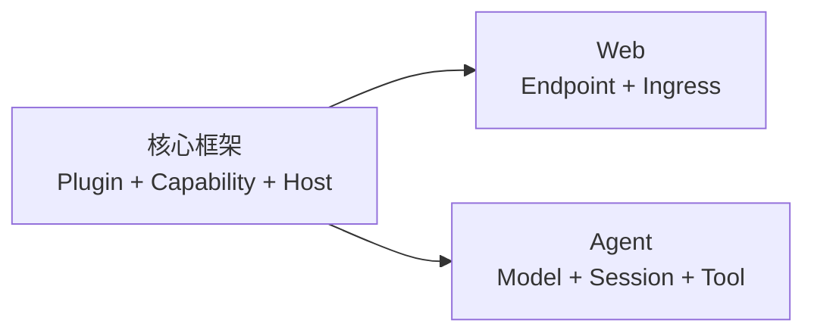

## 你想构建什么？

开始之前不需要先学完整个运行时。先选择想得到的结果，完成一条引导路径；当下一步
确实需要某个框架概念时，再沿页面中的链接深入阅读。

<CardGroup>
  <Card title="学习核心框架" href="/docs/zh/core" description="创建一个可移除的 Plugin，再理解 App、Capability、Host、Plan 与运行时生命周期。" />
  <Card title="构建 Web 后端" href="/docs/zh/web" description="编写类型化 HTTP Endpoint，通过 Web Ingress 绑定，并用真实 Socket 证明结果。" />
  <Card title="运行并扩展 Agent" href="/docs/zh/agent" description="运行维护中的 Agent，选择 Profile，理解它的状态，并增加一个 Tool。" />
</CardGroup>

## 三块内容如何连接

Web 与 Agent 都是构建在同一套框架上的产品路径。它们的教程只解释下一步必需的
Core 概念，并链接到唯一的权威说明，不在多个位置复制同一套知识。

## 想直接查找答案？

<CardGroup>
  <Card title="实现状态" href="/docs/zh/core/status-and-scope" description="区分当前可运行、Early-access 与刻意延后的行为。" />
  <Card title="仓库地图" href="/docs/zh/core/repository-map" description="找到持有 Contract、运行时机制或产品 Plugin 的仓库。" />
  <Card title="使用 Coding Agent 开发" href="/docs/zh/core/agent-skills" description="安装 Lenso 开发技能，并把有边界的任务路由给正确所有者。" />
</CardGroup>
