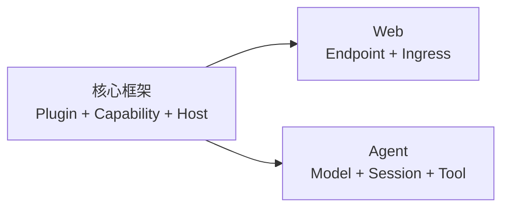

## 你想构建什么？

开始之前不需要先学完整个运行时。先选择想得到的结果，完成一条引导路径；当下一步
确实需要某个框架概念时，再沿页面中的链接深入阅读。

<CardGroup>
  <Card title="学习核心框架" href="/docs/zh/core" description="创建一个可移除的 Plugin，再理解 App、Capability、Host、Plan 与运行时生命周期。" />
  <Card title="构建 Web 后端" href="/docs/zh/web" description="编写类型化 HTTP Endpoint，通过 Web Ingress 绑定，并用真实 Socket 证明结果。" />
  <Card title="运行并扩展 Agent" href="/docs/zh/agent" description="运行维护中的 Agent，选择 Profile，理解它的状态，并增加一个 Tool。" />
</CardGroup>

## 选择一个产品任务

上面的框架路径解释如何构建；下面的任务路径解释目前可以操作什么，以及每条边界由谁持有。
Availability 取决于 Host 与仓库组合；源代码仓库本身不等于公开包或托管服务承诺。

| 结果 | 前置条件 | 所有者与 Availability | 可观察成功 | 预期失败 | 下一页 |
| --- | --- | --- | --- | --- | --- |
| 启动 Console，并识别 App Agent 与 Console Agent | 本地 Console Checkout、匹配的 Agent Binary，以及已配置的 App | Console 持有 Shell、Identity Catalog、Selected-App Context 与集成；当前路径是维护中的本地 Reference Host | 打开 `http://127.0.0.1:3030`，Identity Selector 显示两个 Agent | Binary 缺失或版本不匹配、Host Catalog 不可用，或 Loopback Service 尚未就绪 | [启动并检查 Console](/docs/zh/core/console) |
| 通过 Plugin Root 检查或配置 Selected App | 正在运行的 Console，以及 Host 能解析的 App Root | App 的 Plugin Root 与业务 Plugin 持有配置事实和最终授权；Console 提供管理界面 | `lenso app check` 与 `lenso app show` 描述 Selected App，接受的变更在重启后出现 | Root/Catalog 不匹配、Capability 缺失，或所选 Host 没有显式提供该 Authority | [启动并检查 Console](/docs/zh/core/console) |
| 打开有授权的 Projects Workspace，并创建或读取 Project 或 Issue | Host 链接 Projects Web 与 Workspace Plugin、已认证用户，以及有效 Membership | Projects Provider 持有 Membership、权限、Private Visibility、Revision 与 Idempotency；集成目前 Git-distributed/source-first | Workspace Selector 打开有授权的 Organization，Roadmap、Project 或 Issue View 返回数据 | `401`、`403`、保护 Visibility 的 `404`，或 Revision/Idempotency `409` | [打开 Projects](/docs/zh/core/projects) |
| Enqueue、Claim、Complete、Fail、Retry 或 Inspect 一个 Durable Job | Host 选择的 Jobs Instance、其私有 PostgreSQL Schema，以及有权限的 Producer、Worker、Observer Instance | Jobs 持有 Queue State、Opaque Fenced Lease、Retry 与 Evidence；当前路径是单步 Plugin Contract | Worker 在 Lease 下完成或报告失败；过期 Lease 可安全回收，Observer 能看到 Durable State | Caller 无效、Lease 过期/Fencing 冲突、Retry 耗尽，或 Schema Readiness 失败 | [运行一个 Durable Job](/docs/zh/core/jobs) |

每个链接页面都会说明完整的前置条件、所有者边界、Availability、成功证据与恢复路径。

## 三块内容如何连接

Web 与 Agent 都是构建在同一套框架上的产品路径。它们的教程只解释下一步必需的
Core 概念，并链接到唯一的权威说明，不在多个位置复制同一套知识。

## 想直接查找答案？

<CardGroup>
  <Card title="选择受支持的工作流" href="/docs/zh/core/supported-workflows" description="根据产品目标与运行环境选择持续维护的 Lenso 路径。" />
  <Card title="仓库地图" href="/docs/zh/core/repository-map" description="找到持有 Contract、运行时机制或产品 Plugin 的仓库。" />
  <Card title="使用 Coding Agent 开发" href="/docs/zh/core/agent-skills" description="安装 Lenso 开发技能，并把有边界的任务路由给正确所有者。" />
</CardGroup>
