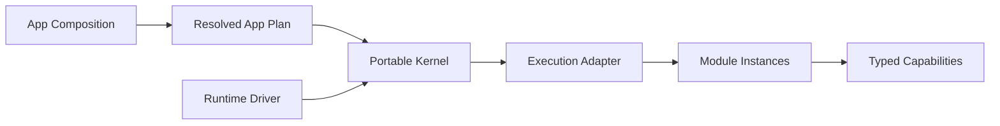

Lenso 是一个 local-first、语言无关的模块化应用运行时。你在 boot 前描述完整 App——锁定
package、keyed Module Instance、typed Capability binding、configuration 与 execution choice——
再让 portable Kernel 执行一份不可变 **Resolved App Plan**。

它带来的实际价值是可控：依赖在启动前可审查，产品行为保持可移除，host mechanics 不会泄漏
进业务模型。

## 选择最短可用入口

<CardGroup>
  <Card title="运行一个 Module" href="/docs/zh/quickstart" description="生成 typed Bun Module，经正式 Adapter 启动，并运行可重复检查。" />
  <Card title="构建产品功能" href="/docs/zh/build-a-feature" description="让一个垂直切片经过 owner、contract、实现、Composition、行为与移除。" />
  <Card title="与 Agent 协作" href="/docs/zh/agent-skills" description="加载 Agent 可读文档、安装 Lenso Skills，并给 Coding Agent 一个可检查结果。" />
  <Card title="选择其他路径" href="/docs/zh/choose-a-path" description="无需先读完全部文档，直接路由 Capability、Rust、Bun、Web、Auth、持久化、runtime 或诊断工作。" />
</CardGroup>

## 60 秒模型

| 部分 | Owner |
| --- | --- |
| **App Composition** | Package、Instance、configuration、binding、execution 与 placement 选择 |
| **Resolved App Plan** | Boot 接受的 canonical immutable bytes |
| **Kernel** | Graph validation、lifecycle、invocation、cancellation、readiness、supervision、diagnostics |
| **Runtime Driver** | Scheduling、monotonic time、task join、cancellation lane、host shutdown |
| **Execution Adapter** | Module generation、endpoint、process/wire、isolation、host failure mechanics |
| **Module** | 产品事实、policy、状态含义、外部 resource 与 managed work |
| **Capability** | Module 之间版本化的 Request、Stream 或 Event 角色 Interface |

Kernel 启动时不会发现 package、改写 binding、安装 provider 或变更图。变更 project，解析新
Plan，审查它，再 restart。

## 当前可用范围

- Portable Kernel 实现 Request、Stream、Event、staged lifecycle、deadline、cancellation、
  diagnostics 与 deterministic conformance。
- Native Rust Module 通过静态注册 factory 支持当前完整交互表面。
- 公共 Bun SDK 提供 typed Request Provider，以及带生成式开发循环的正式子进程 Adapter。
- Capability tooling 从一份 Descriptor 与 JSON Schema source 生成并提交 Rust/TypeScript binding。
- 可选仓库提供 Web、Auth、secret、PostgreSQL lifecycle、OpenTelemetry 与 target-owned Web UI
  building block。

Lenso 当前不承诺 runtime discovery、hot graph mutation、distributed placement、automatic
replica、hostile-code isolation 或独立 Console 产品。不要根据仓库名或保留 Interface 推断，
先读[实现状态](/docs/zh/status-and-scope)。

## 如何阅读文档

1. **从这里开始**：选择可运行路径，并定义完成。
2. **构建**：端到端实现一个分支。
3. **运行与诊断**：验证行为并分类失败。
4. **概念**：仅在任务需要时补充稳定心智模型。
5. **参考**：路由 owner、当前支持范围与规范性决策。

Coding Agent 可以在任意页面 URL 后添加 `.md` 读取 raw Markdown。站点还发布
`https://lenso.dev/llms.txt`、`https://lenso.dev/llms-full.txt` 与
`https://lenso.dev/agent-readability.json`。这些是文档制品，不是 Lenso 的 runtime protocol
或产品 Capability。
