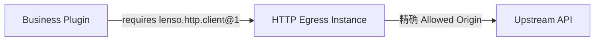

不要在 Business Plugin 内创建 Ambient HTTP Client。声明对
`lenso.http.client@1` 的 Requirement，把它绑定到一个 Egress Instance，并让授予的
Origin 在 Resolved App 中可见。



## 1. 配置精确 Origin 权限

Allowed Origin 只能包含 Scheme、Host 与可选 Port。Path、Credential、Query 与
Fragment 都会被拒绝：

```json title="HTTP Egress Instance configuration"
{
  "allowed_origins": ["https://api.example.test"],
  "max_request_body_bytes": 1048576,
  "max_request_head_bytes": 16384,
  "max_response_body_bytes": 4194304,
  "max_response_head_bytes": 32768,
  "max_concurrent_requests": 64,
  "connect_timeout_millis": 5000,
  "request_timeout_millis": 30000
}
```

`https://api.example.test/v1` 不是有效的配置 Origin。精确 Origin 被接纳后，每次
Request 才选择 Path。

App Composition 必须把 Consumer 的单个 `lenso.http.client@1` Requirement 绑定到
这个 Egress Instance。把 Egress 链入 Host 不等于向所有 Plugin 授予出站网络权限。

## 2. 只解析一次生成的 Client

在 Plugin Activate 阶段从已声明 Dependency 解析 `ClientClient`，并把它保存在
Provider 中。不要为每次 Request 重新发现全局 Client：

```rust
use lenso_capability_http_client::{ClientClient, ClientInvocationError};
use lenso_kernel::{PluginDependencies, RuntimeFailure};

fn client(dependencies: &PluginDependencies) -> Result<ClientClient, RuntimeFailure> {
    ClientClient::from_dependencies(dependencies)
}
```

## 3. 发送一个有边界的 Request

```rust
use lenso_capability_http_client::{SendRequest, SendRequestHeadersItem};

async fn create_order(client: &ClientClient) -> Result<i64, ClientInvocationError> {
    let response = client.send(SendRequest {
        method: "POST".into(),
        url: "https://api.example.test/orders".into(),
        headers: vec![SendRequestHeadersItem {
            name: "content-type".into(),
            value: "application/json".into(),
        }],
        body: br#"{"total_cents":4200}"#.as_slice().into(),
    }).await?;
    Ok(response.status)
}
```

初始 Provider 刻意不提供自动 Redirect、Retry、System Proxy、Referer、Cookie Jar
或 Caller-controlled Authority Header。Credential 应通过显式 Secrets Dependency
加入 Request Header；Secret Value 不能进入不可变 Egress 配置。

## 4. 有意识地处理 Failure

生成的 Domain Error 会区分 `destination_not_allowed`、`invalid_request`、
`request_too_large`、`response_too_large`、`timeout` 与 `transport_failure`。
是否重试由业务边界决定；Transport 不会隐式重复 Request。

测试 Allowed Path、同 Origin 不同 Path、Disallowed Origin、超大 Request/Response、
Timeout、Redirect Response 与 Cancellation。交付前用 `lenso app show` 证明准确的
Consumer-to-Egress Binding。

完整 Wire 与 Error Contract 见
[Web Capabilities](/docs/zh/web/web-capabilities)。
