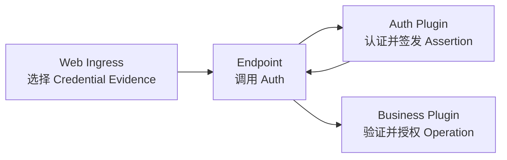

保护 Route 会经过三个 Owner。分开它们，可以避免“凭据有效”被误解成“拥有所有业务权限”：



## 1. 把 Auth 绑定到 Endpoint

Endpoint Provider 声明一个 `AuthClient`，并在 Activate 阶段解析。App Composition
必须发布这条准确 Binding。Web Ingress 不会发现 Auth Provider，也不负责认证决策。

Ingress 接受一个 `Authorization` Credential，把它转换为协议无关的 Scheme/Value
Evidence，并在 Dispatch 前移除 Credential Header。因此下游 Plugin 只会收到
Evidence 或密封 Assertion，而不是 Ambient HTTP Header。

## 2. 在 Handler 签名中显示身份要求

定义 HTTP Edge 需要的 Actor Kind，并把 Extract 委托给 `lenso-http-auth`：

```rust title="src/http.rs"
use lenso_auth_sdk::ActorAssertion;
use lenso_capability_http_endpoint::{ExtractorFuture, FromRequest, HandleRequest};
use lenso_http_auth::{AuthenticatedHttpActor, extract_authenticated_actor};
use lenso_kernel::InvocationContext;

struct UserActor { subject: String }

impl AuthenticatedHttpActor for UserActor {
    const KIND: &'static str = "user";

    fn from_assertion(assertion: &ActorAssertion) -> Self {
        Self { subject: assertion.subject().to_owned() }
    }
}

impl FromRequest<OrdersHttp> for UserActor {
    fn from_request<'a>(
        provider: &'a OrdersHttp,
        context: &'a mut InvocationContext,
        request: &'a HandleRequest,
    ) -> ExtractorFuture<'a, Self> {
        extract_authenticated_actor(provider, context, request)
    }
}
```

Provider 还要实现 `AuthClientSource`，返回 Activate 阶段创建的 Client。Helper 会
转换 Evidence、调用 Auth、生成稳定认证响应，并把返回的 Assertion 附加到
Invocation Context。

把 Actor 写进 Route Signature，让读者不看函数体也能发现认证要求：

```rust title="src/http.rs"
#[endpoint]
impl OrdersHttp {
    #[get("orders.read", "/orders/{order_id}")]
    async fn read(
        &self,
        actor: UserActor,
        context: InvocationContext,
        Path(path): Path<OrderPath>,
    ) -> Result<HandleResponse, EndpointHandleInvocationError> {
        self.handle_authenticated(context, actor.subject, path.order_id).await
    }
}
```

## 3. 在业务 Operation 完成授权

认证只回答“是谁提交了可接受 Evidence”。目标 Plugin 仍需验证 Assertion Issuer、
Ed25519 Proof、有效期和准确 Audience（例如 `orders.api@1:read`），再应用该
Operation 的 Tenant、Ownership 或 Role Policy。目标只得到验证公钥，不能获得 Auth
Signing Key。

有意识地保持状态映射：

| 结果 | HTTP 响应 |
| --- | --- |
| Credential 缺失、无效、过期或撤销 | 带 `WWW-Authenticate` 的 `401` |
| Actor 有效但没有该 Operation 权限 | `403` |
| Auth 或 Business Capability 不可用 | `503` |

## 4. 证明边界

至少测试：无 Credential、格式错误、过期/撤销、有效 Actor、错误 Actor Kind、错误
Operation Audience，以及被业务策略拒绝的有效 Actor。最后几项应经过真实 Ingress
Socket，以覆盖 Credential Strip 与状态映射。

需要实现 Provider、Token 签发、撤销或目标侧 Verifier 时，继续阅读
[Auth Plugin](/docs/zh/web/auth-plugin)。
