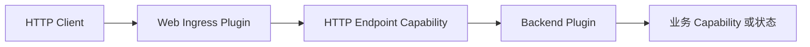

Lenso Web 是由普通 Plugin 与 Capability 组成的后端路径。它不是第二套运行时，也不会
把 HTTP 行为加入可移植 Kernel。

## 一次入站请求

| 所有者 | 持有 | 不持有 |
| --- | --- | --- |
| **Web Ingress** | Listener 生命周期、HTTP 解析、不可变 Route 组装、传输限制、Response 映射 | 业务身份、权限或全局 Endpoint 发现 |
| **Endpoint Plugin** | 稳定 Route ID、请求解码、编排与意图明确的 Response | Listener Socket 或运行时 Route 注册 |
| **Auth Plugin** | 认证 Evidence 与签名 Actor Assertion | 目标资源的最终授权决定 |
| **目标业务 Plugin** | 租户访问、角色、资源所有权与业务规则 | HTTP 传输策略 |

Ingress 会在激活阶段从显式绑定的 Endpoint Provider 收集 Route。重复的 Method/Path
Shape 会让 Readiness 失败，而不是在 App 启动后改变行为。

## 一次出站请求

后端 Plugin 需要 `lenso.http.client@1`。被选择的 Egress Instance 持有精确允许的
Origin、Timeout、Redirect Policy 与传输限制。系统不存在环境式网络权限，也没有
Allow-all 默认值。

## 按目标选择下一页

<CardGroup>
  <Card title="构建后端" href="/docs/zh/web/web-endpoint-plugin" description="从类型化 Endpoint Plugin 与直接 Provider 测试开始。" />
  <Card title="增加 Web 行为" href="/docs/zh/web/web-capabilities" description="有意地增加入站 Route、OpenAPI、认证或出站 HTTP。" />
  <Card title="理解核心框架" href="/docs/zh/core/mental-model" description="理解 Plugin Binding 如何成为一份不可变执行 Plan。" />
</CardGroup>
