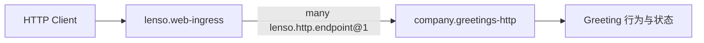

## 构建 Web 后端

这组文档会构建一个包含两条 Route 的小型 JSON 后端：

```text
POST /greetings
GET  /greetings/{greeting_id}
```

实现跨越两个 Plugin 边界。Endpoint Plugin 持有 API 与面向业务的 HTTP
Mapping，`lenso.web-ingress` 持有 Listener 与入站 Transport。



## 当前 Authoring 边界

公共 CLI 目前不提供通用 `lenso plugin new --web` 命令。请在一个已经链接
Native Lenso Runtime、并且能够发布 Host Catalog 的 Host Workspace 中开发。

当前 Authoring Surface 包括：

- 使用 `lenso-capability-http-endpoint` 编写强类型 Route 与 Extractor；
- 使用 `lenso-web-ingress` 提供入站 HTTP Transport；
- 使用 Host 现有的 Linked Native Factory、Registry 与 Catalog Path。

App Configuration 无法让实现凭空出现在 Host Build 中。Endpoint Plugin 与
Ingress 必须先由 Host Catalog 提供。

## 按实现路径阅读

| 步骤 | 文档 | 可观察结果 |
| --- | --- | --- |
| 1 | [编写 Endpoint Plugin](/docs/zh/web/web-endpoint-plugin) | 两条稳定 Route Description 与直接 Handler 测试通过。 |
| 2 | [连接 Host 与 Ingress](/docs/zh/web/web-host-integration) | Resolved App 显示 Endpoint Instance 已绑定到 Ingress。 |
| 3 | [证明 HTTP 后端](/docs/zh/web/web-testing) | 成功、失败、冲突与移除路径都通过真实 Socket。 |

第一个后端运行后，按实际任务继续：

<CardGroup>
  <Card title="保护一个 Endpoint" href="/docs/zh/web/protect-an-endpoint" description="把一个 Authorization Credential 转换为目标验证过的 Actor。" />
  <Card title="调用上游 API" href="/docs/zh/web/call-upstream-api" description="只向一个 Plugin 授予精确 Origin 的 Outbound HTTP 权限。" />
  <Card title="为部署准备 Host" href="/docs/zh/web/deployment-boundary" description="区分 Ingress 保证与 Host 持有的 TLS、打包及拓扑责任。" />
</CardGroup>

把 [Web Capabilities](/docs/zh/web/web-capabilities)作为完整契约参考。需要实现或
运维认证 Provider 本身时，再阅读 [Auth Plugin](/docs/zh/web/auth-plugin)。

## 开始前检查 Host

在目标仓库确认：

1. 仓库选择 Rust 1.94 或更高版本。
2. Lock 已包含 `lenso-capability-http-endpoint` 与 `lenso-web-ingress`，或
   Host Owner 已批准添加它们。
3. Host Registry 可以链接新的 Native Factory。
4. Host Catalog 可以提供 `company.greetings-http`，并把它绑定到 Ingress 的
   `many lenso.http.endpoint@1` Requirement。
5. 真实 Host 或 Integration Test 可以暴露 Listener Address。

遇到缺失项时，在那里停下并与 Host Owner 解决。当前 `lenso-web` Owner
Repository 使用 `lenso-capability-http-endpoint` 0.2.3 和
`lenso-web-ingress` 0.3.3；其他 Host 应使用自身 Lock 选择的准确版本。

## 完成条件

两条 Route 通过真实 Ingress 运行，成功与失败保持可区分，重复 Route 阻止
Readiness，Resolved App 显示准确 Binding，并且移除 Endpoint Instance 会从
下一 Generation 移除两条 Route 时，后端才算完成。

从 [编写 Endpoint Plugin](/docs/zh/web/web-endpoint-plugin) 开始。
